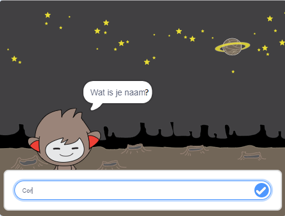

\--- no-print \---

Dit is de **Scratch 3** versie van het project. Er is ook een [Scratch 2 versie van het project](https://projects.raspberrypi.org/en/projects/chatbot-scratch2).

\--- /no-print \---

## Inleiding

Je gaat leren hoe je een personage programmeert dat met je kan praten! Zo'n personage wordt een chat-robot of chatbot genoemd.

### Wat ga je maken

\--- no-print \---

Klik op de groene vlag en klik vervolgens op de chatbot om een ​​gesprek te starten. Wanneer de chatbot een vraag stelt, typ je jouw antwoord in het vak aan de onderkant van het werkgebied en klik je op het blauwe vinkje (of druk op `Enter`) om het antwoord van de chatbot te zien.

  <iframe allowtransparency="true" width="485" height="402" src="https://scratch.mit.edu/projects/embed/248864190/?autostart=false" 
  frameborder="0" scrolling="no"></iframe>

\--- /no-print \---

\--- print-only \---

\--- /print-only \---

\--- collapse \---

* * *

## title: Wat heb je nodig

### Hardware

- Een computer die Scratch 3 kan uitvoeren

### Software

- Scratch 3 (of [online](https://rpf.io/scratchon) of [offline](https://rpf.io/scratchoff))

### Downloads

- [Zoek hier bestanden om te downloaden](http://rpf.io/p/en/chatbot-go).

\--- /collapse \---

\--- collapse \---

* * *

## title: Wat ga je leren

- Use code to concatonate strings in Scratch
- Know that variables can be used to store user input
- Use conditional selection to respond to user input in Scratch \--- /collapse \---

\--- collapse \---

* * *

## title: Aanvullende informatie voor docenten

\--- no-print \---

If you need to print this project, please use the [printer-friendly version](https://projects.raspberrypi.org/en/projects/chatbot/print){:target="_blank"}.

\--- /no-print \---

You can find the [completed project here](http://rpf.io/p/en/chatbot-get).

\--- /collapse \---