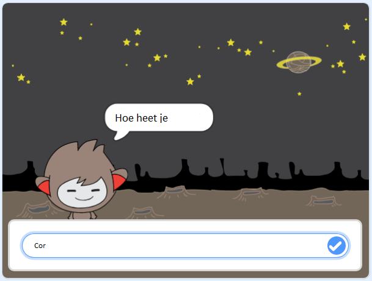

\--- no-print \---

Dit is de **Scratch 3** versie van het project. Er is ook een [Scratch 2 versie van het project](https://projects.raspberrypi.org/en/projects/chatbot-scratch2).

\--- /no-print \---

## Inleiding

Je gaat leren hoe je een personage programmeert dat met je kan praten! Zo'n personage wordt een chat-robot of chatbot genoemd.

### Wat ga je maken

\--- no-print \---

Klik op de groene vlag en klik vervolgens op de chatbot om een ​​gesprek te starten. Wanneer de chatbot een vraag stelt, typ je jouw antwoord in het vak aan de onderkant van het speelveld en klik je op het blauwe vinkje aan de rechterkant (of druk op `Enter`) om het antwoord van de chatbot te zien.

  <iframe allowtransparency="true" width="485" height="402" src="https://scratch.mit.edu/projects/embed/248864190/?autostart=false" 
  frameborder="0" scrolling="no"></iframe>

\--- /no-print \---

\--- print-only \---

\--- /print-only \---

## \--- collapse \---

## title: Wat heb je nodig

### Hardware

- Een computer die Scratch 3 kan uitvoeren

### Software

- Scratch 3 (of [online](https://rpf.io/scratchon) of [offline](https://rpf.io/scratchoff))

### Downloads

- [Zoek hier bestanden om te downloaden](http://rpf.io/p/en/chatbot-go).

\--- /collapse \---

## \--- collapse \---

## title: Wat ga je leren

- Gebruik code om strings in Scatch samen te voegen
- Weet dat variabelen kunnen worden gebruikt om gebruikersinvoer op te slaan
- Gebruik voorwaardelijke selectie om te reageren op gebruikersinvoer in Scratch

\--- /collapse \---

## \--- collapse \---

## title: Aanvullende informatie voor docenten

\--- no-print \---

Als je dit project wilt afdrukken, gebruik dan de [printvriendelijke versie](https://projects.raspberrypi.org/en/projects/chatbot/print) {:target="_ blank"}.

\--- /no-print \---

Hier kun je het [voltooide project](http://rpf.io/p/en/chatbot-get) downloaden.

\--- /collapse \---