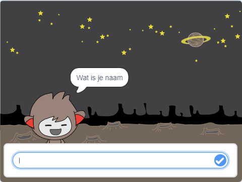
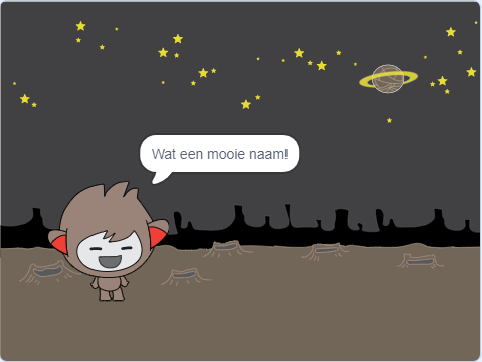
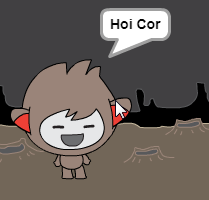

## Een pratende chatbot

Nu dat je een chatbot met een persoonlijkheid hebt, ga je het programmeren om met je te praten.

--- task ---

Klik op je chatbot sprite, en voeg deze code toe zodat `wanneer op deze sprite wordt geklikt`{:class="block3events"}, het `vraagt om je naam`{:class="block3sensing"} en vervolgens `zegt "Wat een mooie naam!"`{:class="block3looks"}.


```blocks3
wanneer op deze sprite wordt geklikt
vraag [Wat is je naam?] en wacht
zeg [Wat een mooie naam!] (2) sec.
```

--- /task ---

--- task ---

Klik op je chatbot om je code te testen. Wanneer de chatbot je naam vraagt, typ deze in het vak dat aan de onderkant van het speelveld verschijnt, en klik dan op het witte vinkje in de blauwe cirkel, of druk op <kbd>Enter</kbd>.





--- /task ---

--- task ---

Op dit moment antwoordt je chatbot met "Wat een mooie naam!" elke keer dat je antwoordt. Je kunt het antwoord van de chatbot persoonlijker maken, zodat het antwoord anders is elke keer dat een andere naam wordt ingetypt.

Wijzig de code van de chatbot sprite in `voeg en samen`{:class="block3operators"} "Hallo" met het `antwoord`{:class="block3sensing"} bij de "Wat is je naam?" vraag, zodat de code er zo uitziet:


```blocks3
wanneer op deze sprite wordt geklikt
vraag [Wat is je naam?] en wacht
zeg (voeg [Hoi ] en (antwoord) samen) (2) sec.
```



--- /task ---

--- task ---

Door het antwoord op te slaan in een **variabele**, kunt je het overal gebruiken in je project.

Maak een nieuwe variabele met de naam `naam`{:class="block3variables"}.

[[[generic-scratch3-add-variable]]]

--- /task ---

--- task ---

Wijzig nu de code van je chatbot sprite door de `antwoord`{:class="block3variables"} waarde in de `naam`{:Class="block3sensing"} variabele te zetten:


```blocks3
wanneer op deze sprite wordt geklikt
vraag [Wat is je naam?] en wacht

+ maak [naam v] (antwoord)
zeg (voeg [Hoi ] en (naam :: variables) samen) (2) sec.
```

Je code zou moeten werken zoals voorheen: je chatbot zou hoi en je naam moeten zeggen.


--- /task ---

Test je project opnieuw. Merk op dat het antwoord dat je invoert, is opgeslagen in de `naam`{:class="block3variables"} variabele, en ook wordt weergegeven in de linkerbovenhoek van het werkgebied. Om het uit het werkgebied wilt laten verdwijnen, gaat je naar de `Variabelen`{:class="block3variables"} blok sectie en klik op het hokje naast `naam`{:class="block3variables"} zodat deze niet meer aangevinkt is.