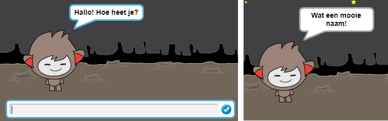
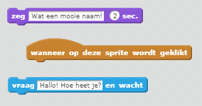
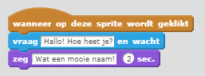
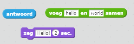
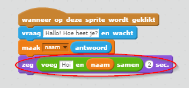
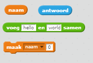
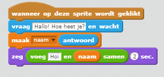
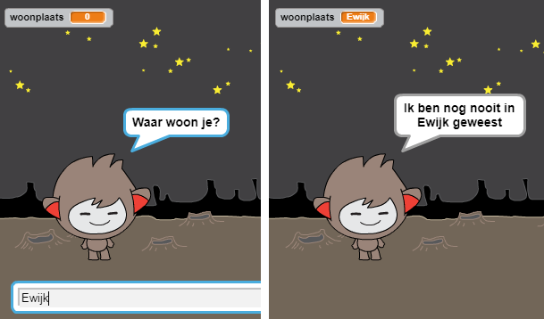

## Een pratende chatbot

Nu dat je een chatbot met een persoonlijkheid hebt, ga je het programmeren om met je te praten.

--- task ---

Voeg code toe aan je chatbot, zodat wanneer je er op klikt, deze naar je naam vraagt ​​en vervolgens zegt: "Wat een mooie naam!"

--- hints --- --- hint --- Wanneer op de chatbot **sprite wordt geklikt**, moet het naar je naam **vragen**. De chatbot moet dan **zeggen** "wat een mooie naam!" --- /hint --- --- hint --- Dit zij de code blokken die je nodig hebt:  --- /hint --- --- hint --- Zo zou je code er moeten uitzien:  --- /hint --- --- /hints ---

--- /task ---

--- task ---

Nu antwoordt de chatbot elke keer met "Wat een mooie naam!". Kunt je het antwoord van je chatbot personaliseren door gebruik te maken van je antwoord?

--- hints --- --- hint --- Wanneer op de chatbot **sprite wordt geklikt**, moet het naar je naam **vragen**. De chatbot zou dan **moeten zeggen** "Hallo", gevolgd door je **antwoord**. --- /hint --- --- hint --- Dit zij de code blokken die je nodig hebt:  --- /hint --- --- hint --- Zo zou je code er moeten uitzien:  --- /hint --- --- /hints ---

--- /task ---

--- task ---

Als je jouw antwoord opslaat in een **variabele**, dan kan dit later worden gebruikt. Maak een nieuwe variabele genaamd `naam` aan om je antwoord in op te slaan.

[[[generic-scratch-add-variable]]]

--- /task ---

--- task ---

Kun je je antwoord opslaan in de `naam` variabele en het gebruiken in het antwoord van je chatbot?

Je code zou moeten werken zoals voorheen: je chatbot zou hallo en je naam moeten zeggen.

--- hints --- --- hint --- Wanneer op de chatbot **sprite wordt geklikt**, moet het naar je naam **vragen**. **Maak** je `naam` variabele gelijk aan je **antwoord**. De chatbot zou dan **moeten zeggen** "Hallo", gevolgd door je **antwoord**. --- /hint --- --- hint --- Dit zij de code blokken die je nodig hebt:  --- /hint --- --- hint --- Zo zou je code er moeten uitzien:  --- /hint --- --- /hints ---

--- /task ---

--- challenge ---

## Uitdaging: meer vragen

Programmeer je chatbot om een ​​andere vraag te stellen. Kun je het antwoord opslaan in een nieuwe variabele?

 --- /challenge ---
