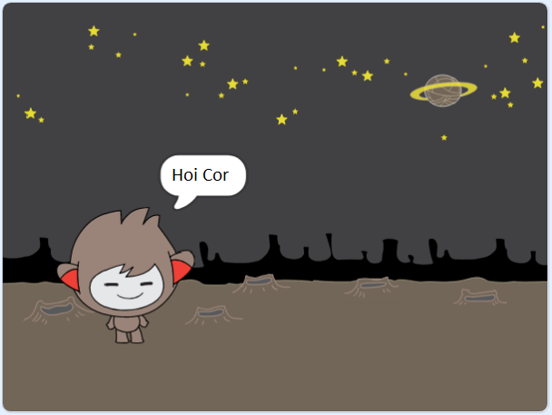

## Een pratende chatbot

Nu dat je een chatbot met een persoonlijkheid hebt, ga je het programmeren om met je te praten.

\--- task \---

Voeg code toe aan je chatbot, zodat wanneer je op klikt, deze naar je naam vraagt ​​en vervolgens zegt: "Wat een mooie naam!"

\--- hints \--- \--- hint \--- Wanneer op de chatbot **sprite wordt geklikt**, moet het naar je naam **vragen**. De chatbot moet dan **zeggen** "wat een mooie naam!" \--- /hint \--- \--- hint \--- Dit zij de code blokken die je nodig hebt:  \--- /hint \--- \--- hint \--- Zo zou je code er moeten uitzien:  \--- /hint \--- \--- /hints --

\--- /task \---

\--- task \---

Nu antwoordt de chatbot elke keer met "Wat een mooie naam!". Kunt je het antwoord van je chatbot personaliseren door gebruik te maken van je antwoord?

\--- hints \--- \--- hint \--- When the chatbot **sprite is clicked**, it should **ask** for your name. The chatbot should then **say** "Hi", followed by your **answer**. \--- /hint \--- \--- hint \--- Here are the code blocks you'll need:  \--- /hint \--- \--- hint \--- Here's how your code should look:  \--- /hint \--- \--- /hints \---

\--- /task \---

\--- task \---

If you store your answer in a **variable**, then it can be used later. Create a new variable called `name` to store your name.

[[[generic-scratch-add-variable]]]

\--- /task \---

\--- task \---

Can you store your answer in the `name` variable and use it in your chatbot's reply?

Your code should work as before: your chatbot should say hello using your name.

\--- hints \--- \--- hint \--- When the chatbot **sprite is clicked**, it should **ask** for your name. You should then **set** the `name` variable to your **answer**. The chatbot should then **say** "Hi", followed by your **name**. \--- /hint \--- \--- hint \--- Here are the code blocks you'll need:  \--- /hint \--- \--- hint \--- Here's how your code should look:  \--- /hint \--- \--- /hints \---

\--- /task \---

\--- challenge \---

## Challenge: meer vragen

Program your chatbot to ask another question. Can you store the answer in a new variable?

 \--- /challenge \---