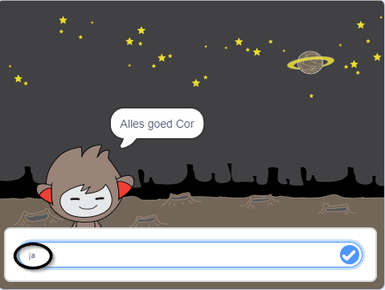
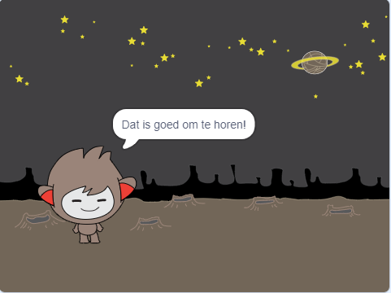
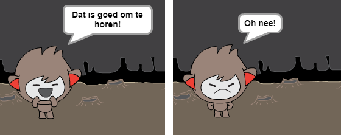
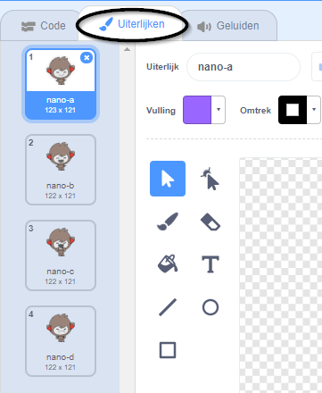
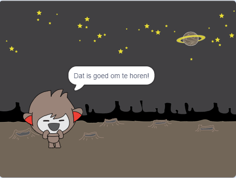
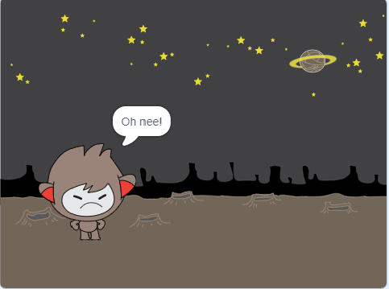
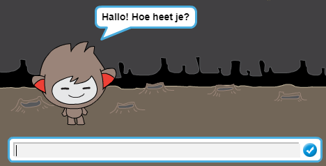
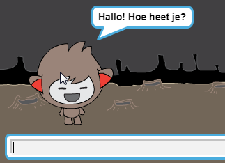

## Het nemen van beslissingen

Je kunt je chatbot programmeren zodat datgene wat het zegt of doet gebaseerd is op jouw antwoorden op zijn vragen.

Allereerst ga je ervoor zorgen dat je chatbot een vraag stelt die kan worden beantwoord met "ja" of "nee".

--- task ---

Wijzig de code van je chatbot. Je chatbot moet de vraag "Alles goed naam", met behulp van de `naam`{:class="block3variables"} variabele stellen. Dan zou het moeten antwoorden: "Dat is goed om te horen!" `als`{:class="block3control"} het antwoord dat het ontvangt "ja" is, maar zeg niets als het antwoord "nee" is.






```blocks3
wanneer op deze sprite wordt geklikt
vraag [Wat is je naam?] en wacht
maak [naam v] (antwoord)
zeg (voeg [Hoi ] en (naam) samen) (2) sec.
+ vraag (voeg [Alles goed] en (naam) samen) en wacht
+ als <(antwoord) = [ja]> dan 
zeg [Dat is goed om te horen!] (2) sec.
end
```

Om je nieuwe code goed te testen, moet je deze **twee keer** uitvoeren: eenmaal met het antwoord "ja", en een keer met het antwoord "nee".

--- /task ---

Op dit moment zegt je chatbot niets bij het antwoord "nee".

--- task ---

Wijzig de code van je chatbot zodat deze antwoordt "Oh nee!" als het "nee" ontvangt als antwoord op "Alles goed naam".

Vervang het `als, dan`{:class="block3control"} blok door een `als, dan, anders`{:class="block3control"} blok en voeg code toe zodat de chatbot kan zeggen: `"Oh nee!"`{:class="block3looks"}.


```blocks3
wanneer op deze sprite wordt geklikt
vraag [Wat is je naam?] en wacht
maak [naam v] (antwoord)
zeg (voeg [Hoi ] en (naam) samen) (2) sec.
vraag (voeg [Alles ok ] en (naam) samen) en wacht

+ als <(antwoord) = [ja]> dan 
zeg [Dat is goed om te horen!] (2) sec.
anders
+ zeg [Oh nee!] (2) sec.
end
```

--- /task ---

--- task ---

Test je code. Je zou een ander antwoord moeten krijgen wanneer je "nee" antwoordt dan wanneer je "ja" antwoordt: je chatbot zou moeten antwoorden met "Dat is goed om te horen!" wanneer je "ja" antwoordt (wat niet hoofdlettergevoelig is) en antwoord met "Oh nee!" wanneer je **iets anders** antwoordt.




--- /task ---

Je kunt elke code in een `als, dan, anders` blok plaatsen, niet alleen code om je chatbot te laten spreken!

Als je op het **Uiterlijken** tabblad van je chatbot klikt, zul je zien dat het meer dan één uiterlijk heeft.



--- task ---

Verander de chatbot code zodat deze verandert van uiterlijk wanneer je je antwoord typt.





Verander de code in het `als, dan, anders`{:class="block3control"} blok om `van uiterlijk te wisselen`{:class="block3looks"}.


```blocks3
wanneer op deze sprite wordt geklikt
vraag [Wat is je naam?] en wacht
maak [naam v] (antwoord)
zeg (voeg [Hoi ] en (naam) samen) (2) sec.
vraag (voeg [Alles goed] en (naam) samen :: operators) en wacht
als <(antwoord) = [ja]> dan 

+ verander uiterlijk naar (nano-c v)
zeg [Dat is goed om te horen!] (2) sec.
anders
+ verander uiterlijk naar (nano-d v)
zeg [Oh nee!] (2) sec.
end
```

Test en sla je code op. Je zou het gezicht van je chatbot moeten zien veranderen, afhankelijk van je antwoord.

--- /task ---

Is het je opgevallen dat, nadat het kostuum van je chatbot is veranderd, het zo blijft en niet teruggaat naar wat het in het begin was?

Je kunt dit uitproberen: voer je code uit en antwoord "nee", zodat het gezicht van je chatbot verandert in een ongelukkige blik. Voer vervolgens je code opnieuw uit en merk op dat je chatbot niet verandert in een blij uiterlijk voordat je naam wordt gevraagd.



--- task ---

Om dit probleem op te lossen, voeg je aan de code van de chatbot `verander uiterlijk naar`{:class="block3looks"} toe aan het begin `wanneer op deze sprite wordt geklikt`{:class="block3events"}.


```blocks3
wanneer op deze sprite wordt geklikt

+ verander uiterlijk naar (nano-a v)
vraag [Wat is je naam?] en wacht
```



--- /task ---