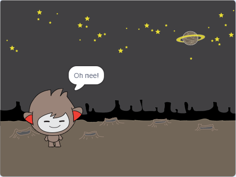

## Het nemen van beslissingen

Je kunt je chatbot programmeren zodat datgene wat het zegt of doet gebaseerd is op jouw antwoorden op zijn vragen.

Allereerst ga je ervoor zorgen dat je chatbot een vraag stelt die kan worden beantwoord met "ja" of "nee".

\--- task \----

Wijzig de code van je chatbot. Je chatbot moet de vraag "Alles goed naam", met behulp van de `naam`{:class="block3variabelen"} variabele stellen. Dan zou het moeten antwoorden: "Dat is goed om te horen!" `als`{:class="block3control"} het antwoord dat het ontvangt "ja" is, maar zeg niets als het antwoord "nee" is.


```blocks3
wanneer op deze sprite wordt geklikt :: events
vraag [Wat is je naam?] en wacht :: sensing
maak [naam v] (antwoord :: sensing) :: variables
zeg (voeg [Hoi ] en (naam) samen :: operators) (2) sec. :: looks
vraag (voeg [Alles goed] en (naam) samen :: operators) en wacht :: sensing
als <(antwoord :: sensing) = [ja] :: operators> dan 
  zeg [Dat is goed om te horen!] (2) sec. :: looks :: control
end
```

Om je nieuwe code goed te testen, moet je deze **twee keer** uitvoeren, eenmaal met het antwoord "ja", en één keer met het antwoord "nee".

\--- /task \---

Op dit moment zegt je chatbot niets bij het antwoord "nee".

\--- task \----

Wijzig de code van je chatbot zodat deze antwoordt "Oh nee!" als het "nee" ontvangt als antwoord op "Alles goed naam".

Vervang de `als, dan`{:class="block3control"} blok door een `als, dan, anders`{:class="block3control"} blok voeg code toe zodat de chatbot kan zeggen: `"Oh nee!"`{:Class="block3looks"}.


```blocks3
wanneer op deze sprite wordt geklikt :: events
vraag [Wat is je naam?] en wacht :: sensing
maak [naam v] (antwoord :: sensing) :: variables
zeg (voeg [Hoi ] en (naam) samen :: operators) (2) sec. :: looks
vraag (voeg [Alles ok ] en (naam) samen :: operators) en wacht :: sensing
als <(antwoord :: sensing) = [ja] :: operators> dan 
  zeg [Dat is goed om te horen!] (2) sec. :: looks
anders
  zeg [Oh nee!] (2) sec. :: looks :: control
end
```

\--- /task \---

\--- taak \---

Test je code. Je zou een ander antwoord moeten krijgen wanneer je "nee" antwoordt dan wanneer je "ja" antwoordt: je chatbot zou moeten antwoorden met "Dat is goed om te horen!" wanneer je "ja" antwoordt (wat niet hoofdlettergevoelig is) en antwoord met "Oh nee!" wanneer je **iets anders** antwoordt.




\--- /task \---

Je kunt elke code in een `als, dan, anders` blok plaatsen, niet alleen code om je chatbot te laten spreken!

Als je op het **Uiterlijken** tabblad van je chatbot klikt, zul je zien dat het meer dan één uiterlijk heeft.


\--- task \----

Verander de chatbot code zodat deze verandert van uiterlijk wanneer je je antwoord typt.


Verander de code in het `als, dan, anders`{:class="block3control"} blok om `van uiterlijk te wisselen`{:Class="block3looks"}.


```blocks3
when this sprite clicked
ask [What's your name?] and wait
set [name v] to (answer)
say (join [Hi ] (name)) for (2) seconds
ask (join [Are you OK ] (name)) and wait
if <(answer) = [yes]> then 

+  switch costume to (nano-c v)
  say [That's great to hear!] for (2) seconds
else 
+  switch costume to (nano-d v)
  say [Oh no!] for (2) seconds
end
```

Test and save your code. You should see your chatbot's face change depending on your answer.

\--- /task \---

Have you noticed that, after your chatbot's costume has changed, it stays like that and doesn't change back to what it was at the beginning?

You can try this out: run your code and answer "no" so that your chatbot's face changes to an unhappy look. Then run your code again and notice that your chatbot does not change back to looking happy before it asks your name.


\--- task \----

To fix this problem, add to the chatbot's code to `switch costume`{:class="block3looks"} at the start `when the sprite is clicked`{:class="block3events"}.


```blocks3
when this sprite clicked

+ switch costume to (nano-a v)
ask [What's your name?] and wait
```


\--- /task \---