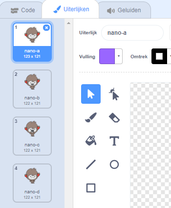

## Beslissingen nemen

Je kunt je chatbot programmeren zodat datgene wat het zegt of doet gebaseerd is op jouw antwoorden op zijn vragen.

--- task ---

Kun je de chatbot de vraag stellen "Alles goed?", en hem coderen om te antwoorden "Dat is geweldig om te horen!" alleen **als** het antwoordt van de gebruiker "ja" is?

Om je nieuwe code goed te testen, moet je deze **twee keer testen**, eenmaal met het antwoord "ja", en één keer met het antwoord "nee".

Je chatbot zou moeten antwoorden "Dat is goed om te horen!!" als je "ja" antwoordt, maar zegt niets als je "nee" antwoordt.

--- hints --- --- hint --- Nadat je chatbot "Hallo" heeft gezegd, zou het nu ook **moeten vragen** "Alles goed?". **Als** je antwoordt "ja" is, dan moet de chatbot **zeggen** "Dat is goed om te horen!". --- /hint --- --- hint --- Dit zijn de code blokken die je nodig hebt:  --- /hint --- --- hint --- Zo zou je code er moeten uitzien:  --- /hint --- --- /hints ---

--- /task ---

--- task ---

Op dit moment zegt je chatbot niets als je "nee" antwoordt. Kun je je chatbot veranderen zodat deze antwoordt "Oh nee!" als je "nee" op zijn vraag antwoordt?

Testen en opslaan. Je chatbot zou nu moeten zeggen "Oh nee!" als je "nee" antwoordt. In feite zal het "Nee!" zeggen als je antwoordt met iets anders dan "ja" antwoord. (de **anders** in een `als dan / anders` blok betekent **doe iets anders als het antwoord niet gelijk is**).

--- hints --- --- hint --- Je chatbot zou nu moeten zeggen: "Dat is goed om te horen!" **als** je antwoord "ja" is, maar zou moeten zeggen "Oh nee!" als je iets anders **antwoordt**. --- /hint --- --- hint --- Dit zijn de code blokken die je nodig hebt:  --- /hint --- --- hint --- Zo zou je code er moeten uitzien:  --- /hint --- --- /hints ---

--- /task ---

--- task ---

Je kunt elke code in een `als dan / anders` blok plaatsen, niet alleen code om je chatbot te laten spreken. Als je op het **Uiterlijken tabblad** van je chatbot klikt, zul je zien dat het meer dan één uiterlijk heeft.

--- /task ---

--- task ---

Kun je het uiterlijk van de chatbot aanpassen aan je reactie?

Testen en opslaan. Het gezicht van je chatbot zou moeten veranderen afhankelijk van je antwoord.

--- hints --- --- hint --- Je chatbot zou nu ook **van uiterlijk moeten veranderen** afhankelijk van het gegeven antwoord. --- /hint --- --- hint --- Dit zijn de code blokken die je nodig hebt:  --- /hint --- --- hint --- Zo zou je code er moeten uitzien:  --- /hint --- --- /hints ---

--- /task ---

--- task ---

Is het je opgevallen dat het uiterlijk van je chatbot hetzelfde blijft als de laatste keer dat je hem sprak? Kun je dit probleem oplossen?

Testen en opslaan: Voer je code uit en typ "nee", zodat je chatbot er ongelukkig uit ziet. Wanneer je jouw code opnieuw uitvoert, moet je chatbot terug naar een lachend gezicht veranderen alvorens je naam te vragen.

--- hints --- --- hint --- Wanneer op de sprite **wordt geklikt**, moet je chatbot eerst **veranderen van uiterlijk** naar een lachend gezicht. --- /hint --- --- hint --- Dit zijn de code blokken die je nodig hebt:  --- /hint --- --- hint --- Zo zou je code er moeten uitzien:  --- /hint --- --- /hints ---

--- /task ---

--- challenge ---

## Uitdaging: meer beslissingen

Programmeer je chatbot om een ​​andere vraag te stellen - iets met een "ja" of "nee" antwoord. Kun je je chatbot laten reageren op het antwoord?

 --- /challenge ---
