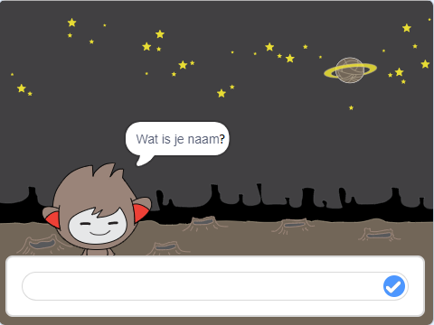

## Het nemen van beslissingen

Je kunt je chatbot programmeren zodat datgene wat het zegt of doet gebaseerd is op jouw antwoorden op zijn vragen.

Allereerst ga je ervoor zorgen dat je chatbot een vraag stelt die kan worden beantwoord met "ja" of "nee".

\--- task \----

Wijzig de code van je chatbot. Je chatbot moet de vraag "Alles goed naam", met behulp van de `naam`{:class="block3variabelen"} variabele stellen. Dan zou het moeten antwoorden: "Dat is goed om te horen!" `als`{:class="block3control"} het antwoord dat het ontvangt "ja" is, maar zeg niets als het antwoord "nee" is.


```blocks3
when this sprite clicked
ask [What's your name?] and wait
set [name v] to (answer)
say (join [Hi ] (name)) for (2) seconds
+ask (join [Are you OK ] (name)) and wait
+if <(answer) = [yes]> then 
  say [That's great to hear!] for (2) seconds
end
```

To test your new code properly, you should test it **twice**: once with the answer "yes", and once with the answer "no".

\--- /task \---

At the moment, your chatbot doesn't doesn't say anything to the answer "no".

\--- task \----

Change your chatbot's code so that it replies "Oh no!" if it receives "no" as the answer to "Are you OK name".

Replace the `if, then`{:class="block3control"} block with an `if, then, else`{:class="block3control"} block, and include code so the chatbot can `say "Oh no!"`{:class="block3looks"}.


```blocks3
when this sprite clicked
ask [What's your name?] and wait
set [name v] to (answer)
say (join [Hi ] (name)) for (2) seconds
ask (join [Are you OK ] (name)) and wait

+ if <(answer) = [yes]> then 
  say [That's great to hear!] for (2) seconds
else 
+  say [Oh no!] for (2) seconds
end
```

\--- /task \---

\--- taak \---

Test your code. You should get a different response when you answer "no" and when you answer "yes": your chatbot should reply with "That’s great to hear!" when you answer "yes" (which is not case-sensitive), and reply with "Oh no!" when you answer **anything else**.


\--- /task \---

You can put any code inside an `if, then, else`{:class="block3control"} block, not just code to make your chatbot speak!

If you click your chatbot's **Costumes** tab, you'll see that there is more than one costume.


\--- task \----

Change your chatbot's code so that the chatbot switches costumes when you type in your answer.


Change the code inside the `if, then, else`{:class="block3control"} block to `switch costume`{:class="block3looks"}.


```blocks3
when this sprite clicked
ask [What's your name?] and wait
set [name v] to (answer)
say (join [Hi ] (name)) for (2) seconds
ask (join [Are you OK ] (name)) and wait
if <(answer) = [yes]> then 

+  switch costume to (nano-c v)
  say [That's great to hear!] for (2) seconds
else 
+  switch costume to (nano-d v)
  say [Oh no!] for (2) seconds
end
```

Test and save your code. You should see your chatbot's face change depending on your answer.

\--- /task \---

Have you noticed that, after your chatbot's costume has changed, it stays like that and doesn't change back to what it was at the beginning?

You can try this out: run your code and answer "no" so that your chatbot's face changes to an unhappy look. Then run your code again and notice that your chatbot does not change back to looking happy before it asks your name.


\--- task \----

To fix this problem, add to the chatbot's code to `switch costume`{:class="block3looks"} at the start `when the sprite is clicked`{:class="block3events"}.


```blocks3
when this sprite clicked

+ switch costume to (nano-a v)
ask [What's your name?] and wait
```



\--- /task \---