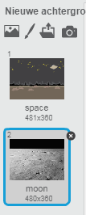
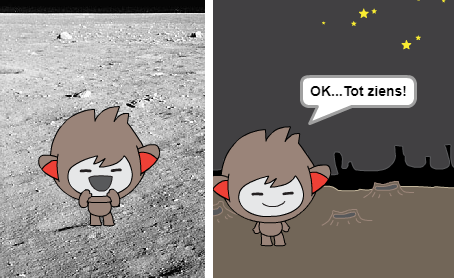
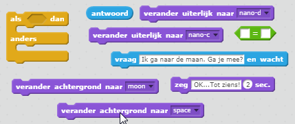
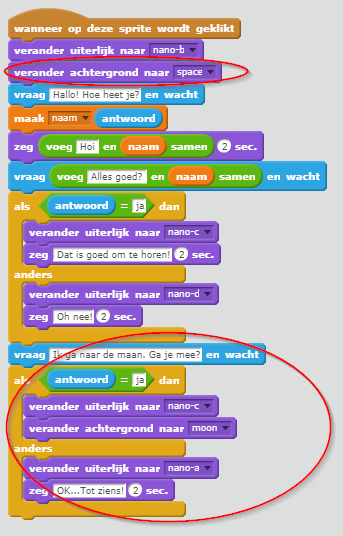
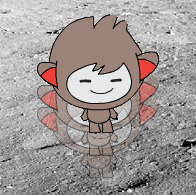
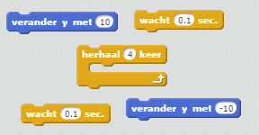
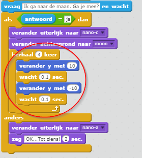

## Locatie wijzigen

Je kunt je chatbot ook coderen om de locatie te wijzigen.

+ Voeg nog een achtergrond toe aan je werkgebied, bijvoorbeeld de achtergrond 'maan'.
    
    

+ Kun je je chatbot coderen om te vragen "Ga je mee naar de maan?" en verander van locatie als je 'ja' antwoordt?
    
    Testen en opslaan. Als je "ja" beantwoordt, moet je chatbot van locatie wijzigen. Je chatbot moet triest kijken en "OK... tot ziens!" zeggen bij elke ander antwoord dat wordt gegeven.
    
    

--- hints --- --- hint --- Je chatbot moet **vragen** "Ga je mee naar de maan?". **Als** je **antwoord** "ja" is, dan zou je chatbot **van uiterlijk moeten veranderen** om er gelukkig uit te zien en de **achtergrond** zou moeten veranderen.

Als je "nee" antwoordt, moet de chatbot **van uiterlijk veranderen** om er droevig uit te zien en **zegge** "OK... tot ziens!"

Je moet ook code toevoegen om je chatbot met de juiste achtergrond te starten **wanneer erop geklikt wordt**. --- /hint --- --- hint --- Dit zijn de code blokken die je nodig hebt:  --- /hint --- --- hint --- Zo zou je code er uit moeten zien:  --- /hint --- --- /hints ---

+ Kun je code toevoegen om je chatbot van vreugde te laten springen als je zegt dat je naar de maan wilt?
    
    Test en opslaan. Als je "ja" antwoordt, moet je chatbot op en neer springen. Je chatbot mag niet springen als er een ander antwoord wordt gegeven.
    
    

--- hints --- --- hint --- Je chatbot zou moeten springen door zijn **y-positie** met een kleine hoeveelheid **te veranderen**, en dan zijn positie weer terug te veranderen na een korte **wachttijd**. Je kunt dit misschien een paar keer **herhalen**. --- /hint --- --- hint --- Dit zijn de code blokken die je nodig hebt:  --- /hint --- --- hint --- Zo zou je code er moeten uitzien:  --- /hint --- --- /hints ---
