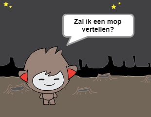

## Uitdaging: meer beslissingen

Programmeer je chatbot om een andere vraag te stellen die beantwoord kan worden met "ja" of "nee". Kan je je chatbot anders laten reageren, afhankelijk van welk antwoord het ontvangt?

