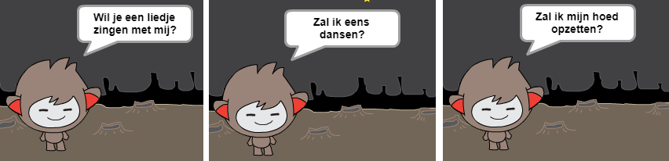

--- challenge ---

## Uitdaging: maak je chatbot af

Gebruik wat je hebt geleerd om je interactieve chatbot af te maken. Hier zijn enkele ideeën:

Als je klaar bent met het maken van je chatbot, laat je je vrienden er een gesprek mee voeren! Vinden ze je chatbot leuk? Hebben ze problemen ontdekt? --- /challenge ---
***
### Door de community geleverde vertaling 

Dit project werd vertaald door **Cor Groot** en gecontroleerd door **Jeroen Dekker**. 

Onze geweldige vertalers helpen ons om kinderen over de hele wereld de kans te geven te leren coderen. Jij kunt ons helpen nog meer kinderen te bereiken door onze projecten te vertalen - lees meer op [rpf.io/translators](https://rpf.io/translators).
