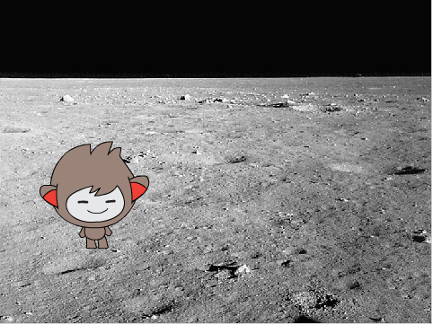

## Locatie wijzigen

Je kunt je chatbot ook programmeren om de locatie te veranderen!



--- task ---

Kun je je chatbot programmeren om "Ik ga naar de maan, ga je mee?" te vragen en dan de achtergrond te veranderen wanneer het antwoord "ja" is?

--- hints ---


--- hint ---

Je chatbot zou moeten `vragen "Ik ga naar de maan. Ga je mee?"`{:class="block3sensing"}, en `als`{:class="block3control"} je `antwoord`{:class="block3sensing"} "ja" is, moet `de achtergrond veranderen in de maan`{:class="block3looks"}.

--- /hint ---

--- hint ---

Hier zijn de code blokken die je moet toevoegen aan je chatbot code.


```blocks3
verander achtergrond naar (moon v)

vraag [Ik ga naar de maan. Ga je mee?] en wacht

als <(antwoord) = [ja]> dan

end
```

--- /hint ---

--- hint ---

Dit is hoe je code eruit zou moeten zien:

```blocks3
vraag [Ik ga naar de maan. Ga je mee?] en wacht
als <(antwoord) = [ja]> dan 
verander achtergrond naar (moon v)
end
```

--- /hint ---

--- /hints ---

--- /task ---

--- task ---

Nu moet je ervoor zorgen dat je chatbot op de juiste locatie start als je erop klikt om ermee te praten. Voeg dit blok toe aan de bovenkant van je chatbot-code:


```blocks3
wanneer op deze sprite wordt geklikt

+ verander achtergrond naar (space v)
```

--- /task ---

--- task ---

Test je programma en beantwoord "ja" wanneer de chatbot vraagt of je naar de maan wilt gaan. Je zou moeten zien dat de locatie van de chatbot verandert.

--- /task ---

--- task ---

Je kunt ook de volgende code toevoegen binnen het nieuwe `als`{:class="block3control"} blok om de chatbot vier keer op en neer te laten springen als je "ja" antwoordt:


```blocks3
als <(antwoord) = [ja]> dan 
verander achtergrond naar (moon v)

+ herhaal (4) keer 
verander y met (10)
wacht (0.1) sec.
verander y met (-10)
wacht (0.1) sec.
end
end
```

--- /task ---