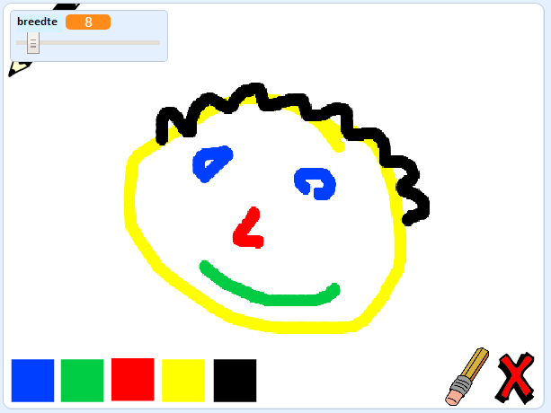

## Wat nu?

Probeer het [Paint Box](https://projects.raspberrypi.org/en/projects/paint-box?utm_source=pathway&utm_medium=whatnext&utm_campaign=projects) project, waar je je eigen teken programma gaat maken!

\--- no-print \--- Klik op de groene vlag om te starten. Gebruik de muis om het potlood te verplaatsen en houd de linkermuisknop ingedrukt om te tekenen. Klik op een kleur om van potlood te wisselen. Klik op de gum om daar naar toe te wisselen en gebruik deze om je werk uit te gummen. Klik op het kruisje om de hele pagina te wissen.

  <iframe allowtransparency="true" width="485" height="402" src="//scratch.mit.edu/projects/embed/267243161/?autostart=false" frameborder="0" scrolling="no"></iframe>
  

\--- /no-print \---

\--- print-only \--- Je klikt op de groene vlag om te starten, je gebruikt de muis om het potlood te verplaatsen en houd de linkermuisknop ingedrukt om te tekenen. Door op een kleur te klikken zal de penkleur veranderen, en een klik op de gum zal deze in een gum veranderen!

 \--- /print-only \---