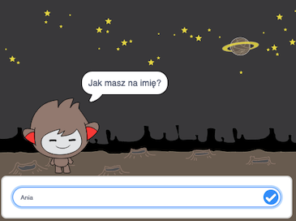

\--- no-print \---

Ta wersja projektu jest przeznaczona dla języka **Scratch 3**. Projekt dostępny jest również [w wersji dla języka Scratch 2](https://projects.raspberrypi.org/en/projects/chatbot-scratch2).

\--- /no-print \---

## Wprowadzenie

Nauczysz się programować postać, która może z tobą rozmawiać! Taka postać nazywana jest robotem czatu lub chatbotem.

### Co stworzysz

\--- no-print \---

Kliknij zieloną flagę, a następnie kliknij znak chatbota, aby rozpocząć rozmowę. Gdy chatbot zada pytanie, wpisz odpowiedź w polu u dołu stołu montażowego, a następnie kliknij na niebieski znaczek po prawej stronie (lub naciśnij klawisz `Enter`), aby zobaczyć odpowiedź chatbota.

  <iframe allowtransparency="true" width="485" height="402" src="https://scratch.mit.edu/projects/embed/248864190/?autostart=false" 
  frameborder="0" scrolling="no"></iframe>

\--- /no-print \---

\--- print-only \---

\--- /print-only \---

\--- collapse \---

* * *

## title: Czego będziesz potrzebować

### Sprzęt

- Komputer pozwalający uruchomić Scratch 3

### Oprogramowanie

- Scratch 3 ([online](https://rpf.io/scratchon) lub [offline](https://rpf.io/scratchoff))

### Pobrane

- [Znajdź tutaj pliki do pobrania](http://rpf.io/p/en/chatbot-go) .

\--- /collapse \---

\--- collapse \---

* * *

## title: Czego się nauczysz

- Używania kodu do łączenia ciągów w programie Scratch
- Wiedzy, że zmienne mogą być używane do przechowywania danych wprowadzanych przez użytkownika
- Używania wyboru warunkowego, aby odpowiedzieć na dane wprowadzone przez użytkownika w programie Scratch \--- / collapse \---

\--- collapse \---

* * *

## title: Dodatkowe informacje dla edukatorów

\--- no-print \---

Jeśli chcesz wydrukować ten projekt, użyj [wersji do druku](https://projects.raspberrypi.org/en/projects/chatbot/print){:target="_blank"}.

\--- /no-print \---

You can find the [completed project here](http://rpf.io/p/en/chatbot-get).

\--- /collapse \---