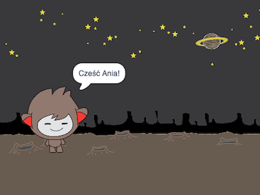

## Rozmawiający robot

Teraz, gdy masz już chatbota z osobowością, zaprogramujesz go tak, aby z tobą rozmawiał.

\--- task \---

Kliknij na swoim duszku chatbota i dodaj do niego ten kod, aby `po kliknięciu`{:class="block3events"}, `zapytał o twoje imię`{:class="block3sensing"}, a następnie `powiedział "Co za urocze imię!"`{:class="block3looks"}.


```blocks3
kiedy duszek zostanie kliknięty
zapytaj [Jak masz na imię?] i poczekaj
powiedz [Co za piękne imię!] przez (2) sekundy
```

\--- /task \---

\--- task \---

Kliknij na swoim chatbocie, aby przetestować swój kod. Gdy chatbot zapyta o twoje imię, wpisz je w polu, które pojawi się na dole ekranu, a następnie kliknij niebieski znak lub naciśnij <kbd>Enter</kbd>.


\--- /task \---

\--- task \---

W tej chwili twój chatbot odpowiada „Co za piękne imię!” za każdym razem, gdy odpowiadasz na jego pytanie. Możesz uczynić odpowiedź chatbota bardziej osobistą, aby odpowiedź była inna za każdym razem, gdy wpisywana jest inne imię.

Zmień kod duszka chatbota na `dołącz`{:class="block3operators"} "Witaj" z `odpowiedzią`{:class="block3sensing"} do pytania "Jak masz na imię?", aby kod wyglądał tak:


```blocks3
when this sprite clicked
ask [What's your name?] and wait
say (join [Hi ] (answer) :: +) for (2) seconds
```



\--- /task \---

\--- task \---

By storing the answer in a **variable**, you can use it anywhere your project.

Create a new variable called `name`{:class="block3variables"}.

[[[generic-scratch3-add-variable]]]

\--- /task \---

\--- task \---

Now, change your chatbot sprites’s code to set the `name`{:class="block3variables"} variable to `answer`{:class="block3sensing"}:


```blocks3
when this sprite clicked
ask [What's your name?] and wait

+ set [name v] to (answer)
say (join [Hi ] (name :: variables +)) for (2) seconds
```

Your code should work as before: your chatbot should say hi using the name you type in.


\--- /task \---

Test your program again. Notice that the answer you type in is stored in the `name`{:class="block3variables"} variable, and is also shown in the top left-hand corner of the Stage. To make it disappear from the Stage, go to the `Data`{:class="block3variables"} blocks section and click on the box next to `name`{:class="block3variables"} so that it is not marked.