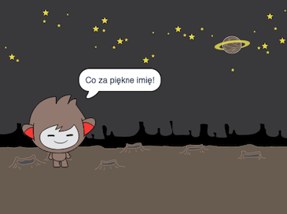

## Rozmawiający robot

Teraz, gdy masz już chatbota z osobowością, zaprogramujesz go tak, aby z tobą rozmawiał.

\--- task \---

Kliknij na swoim duszku chatbota i dodaj do niego ten kod, aby `po kliknięciu`{:class="block3events"}, `zapytał o twoje imię`{:class="block3sensing"}, a następnie `powiedział "Co za piękne imię!"`{:class="block3looks"}.


```blocks3
kiedy ten duszek kliknięty
zapytaj [Jak masz na imię?] i czekaj
powiedz [Co za piękne imię!] przez (2) sekund
```

\--- /task \---

\--- task \---

Kliknij na swoim chatbocie, aby przetestować swój kod. Gdy chatbot zapyta o twoje imię, wpisz je w polu, które pojawi się na dole sceny, a następnie kliknij niebieski znak lub naciśnij <kbd>Enter</kbd>.




\--- /task \---

\--- task \---

W tej chwili twój chatbot odpowiada „Co za piękne imię!” za każdym razem, gdy odpowiadasz na jego pytanie. Możesz uczynić odpowiedź chatbota bardziej osobistą, aby odpowiedź była inna za każdym razem, gdy wpisywana jest inne imię.

Zmień kod duszka chatbota na `połącz`{:class="block3operators"} "Witaj" z `odpowiedzią`{:class="block3sensing"} do pytania "Jak masz na imię?", aby kod wyglądał tak:


```blocks3
kiedy ten duszek kliknięty
zapytaj [Jak masz na imię?] i czekaj
powiedz [(połącz [Cześć ] (odpowiedź) :: +) przez (2) sekund
```


\--- /task \---

\--- task \---

Zapisując odpowiedź w **zmiennej**, możesz jej używać w dowolnym miejscu swojego projektu.

Utwórz nową zmienną o nazwie `imię`{:class="block3variables"}.

[[[generic-scratch3-add-variable]]]

\--- /task \---

\--- task \---

Teraz zmień kod duszka chatbota, aby ustawić zmienną `imię`{:class="block3variables"} na `odpowiedź`{:class="block3sensing"}:


```blocks3
kiedy ten duszek kliknięty
zapytaj [Jak masz na imię?] i czekaj

+ ustaw [imię v] na (odpowiedź)
powiedz (połącz [Cześć ] (imię :: zmienne +)) przez (2) sekund
```

Twój kod powinien działać, jak wcześniej: robot powinien powiedzieć "cześć" i użyć wprowadzonego imienia.


\--- /task \---

Przetestuj swój program ponownie. Zwróć uwagę, że wpisana odpowiedź jest zapisana w zmiennej `imię`{:class="block3variables"} i jest również wyświetlana w lewym górnym rogu sceny. Aby spowodować, że odpowiedź zniknie ze sceny, przejdź do sekcji bloczków `Dane`{:class="block3variables"} i kliknij pole obok `imię`{:class="block3variables"} tak, aby nie było zaznaczone.