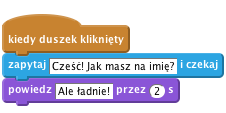
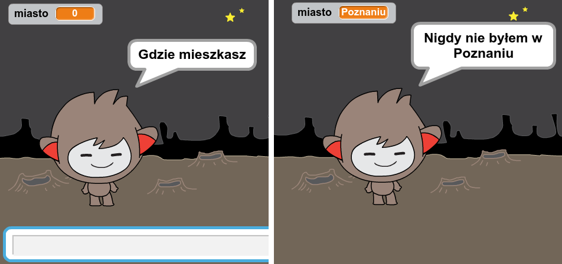

## Rozmawiający robot

Teraz, kiedy znasz już cechy charakteru swojego robota, zaprogramuj go tak, aby do Ciebie mówił.

+ Dodaj kod do twojego robota tak, aby po kliknięciu, pytał się o Twoje imię i odpowiadał "Jakie ładne imię!"
    
    

[[[generic-scratch-saving]]]

\--- hints \--- \--- hint \--- Kiedy **duszek zostanie kliknięty**, powinien **zapytać się** o Twoje imię. Robot powinien wtedy **powiedzieć** "Ale ładne imię!" \--- /hint \--- \--- hint \--- Oto bloki, których będziesz potrzebować:  \--- /hint \--- \--- hint \--- Tak powinien wyglądać twój kod:  \--- /hint \--- \--- /hints \---

+ Twój robot za każdym razem odpowie "Ale ładne imię!". Czy możesz spersonalizować odpowiedź swojego robota tak, aby użył imienia, które wprowadziłeś?
    
    

\--- hints \--- \--- hint \--- Kiedy **duszek zostanie kliknięty**, powinien **zapytać się** o Twoje imię. Robot powinien **wyświetlić** słowo "Cześć", a następnie wprowadzone przez Ciebie **imię**. \--- /hint \--- \--- hint \--- Oto bloki, których będziesz potrzebować:  \--- /hint \--- \--- hint \--- Tak powinien wyglądać twój kod:  \--- /hint \--- \--- /hints \---

+ Jeśli zapiszesz wprowadzone przez siebie imię w **zmiennej**, będziesz mógł użyć go ponownie. Utwórz w tym celu nową zmienną o nazwie `imię`.

[[[generic-scratch-add-variable]]]

+ Czy wiesz, jak zapisać wprowadzone imię w zmiennej `imię` i użyć jej w odpowiedzi Twojego robota?
    
    Twój kod powinien działać, jak wcześniej: robot powinien powiedzieć "cześć" i użyć wprowadzonego imienia.
    
    

\--- hints \--- \--- hint \--- Kiedy **duszek zostanie kliknięty**, powinien **zapytać się** o Twoje imię. Powinieneś wtedy **przypisać** zmiennej `imię` wartość uzyskaną po wpisaniu wybranego przez Ciebie **imienia**. Robot powinien **wyświetlić** słowo "Cześć", a następnie wprowadzone przez Ciebie **imię**. \--- /hint \--- \--- hint \--- Oto bloki, których będziesz potrzebować:  \--- /hint \--- \--- hint \--- Tak powinien wyglądać twój kod:  \--- /hint \--- \--- /hints \---

\--- challenge \---

## Wyzwanie: więcej pytań

Zaprogramuj swojego robota gadułę tak, aby zadawał również inne pytania. Czy potrafisz zapisać odpowiedzi na te pytania w nowych zmiennych?

 \--- /challenge \---