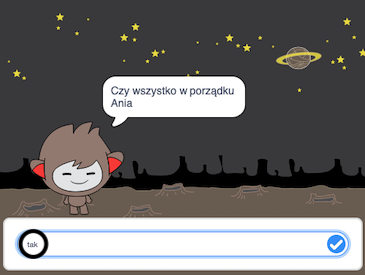
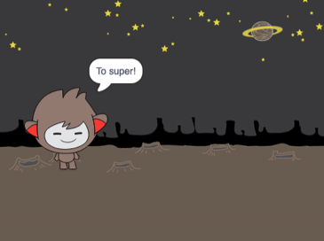
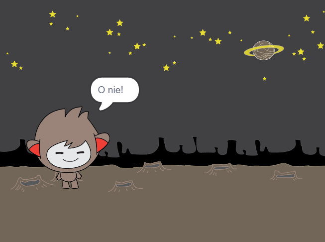
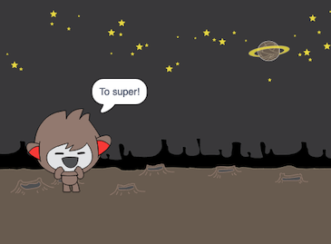
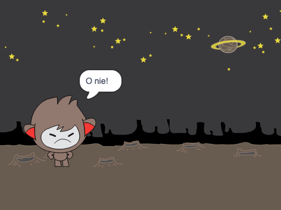
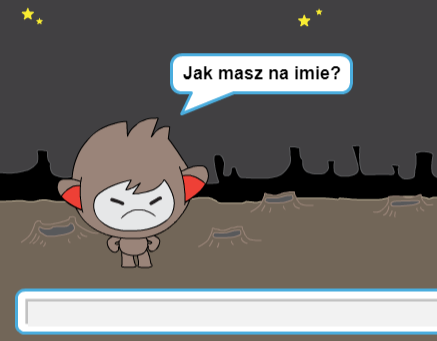
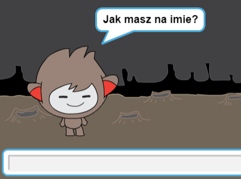

## Podejmowanie decyzji

Możesz zaprogramować swojego robota gadułę tak, aby decydował, co robić na podstawie otrzymanych odpowiedzi.

Najpierw zmusisz swojego robota gadułę do zadania pytania, na które można odpowiedzieć „tak” lub „nie”.

\--- task \---

Zmień kod swojego robota. Twój robot gaduła powinien zadać pytanie „Czy wszystko w porządku imię”, używając zmiennej `imię`{:class="block3variables"}. Następnie powinien odpowiedzieć „To super!” `jeśli`{:class="block3control"} odpowiedź, którą otrzymuje brzmi „tak”, ale nie powinien nic powiedzieć, jeśli odpowiedź brzmi „nie”.






```blocks3
when this sprite clicked
ask [What's your name?] and wait
set [name v] to (answer)
say (join [Hi ] (name)) for (2) seconds
+ask (join [Are you OK ] (name)) and wait
+if <(answer) = [yes]> then 
  say [That's great to hear!] for (2) seconds
end
```

Aby dokładnie przetestować swój program, musisz sprawdzić go **dwa razy** - raz wpisując odpowiedź "tak "i drugi raz wpisując "nie".

\--- /task \---

W tej chwili twój robot gaduła nic nie mówi na odpowiedź „nie”.

\--- task \---

Zmień kod robota, aby odpowiadał „O nie!” jeśli otrzyma „nie” jako odpowiedź na „Czy wszystko w porządku imię”.

Zastąp bloczek `jeśli, to`{:class="block3control"} na bloczek `jeśli, to, w przeciwnym razie`{:class="block3control"} i dołącz kod, aby robot gaduła mógł powiedzieć `"O nie!"`{:class="block3looks"}.


```blocks3
when this sprite clicked
ask [What's your name?] and wait
set [name v] to (answer)
say (join [Hi ] (name)) for (2) seconds
ask (join [Are you OK ] (name)) and wait

+ if <(answer) = [yes]> then 
  say [That's great to hear!] for (2) seconds
else 
+  say [Oh no!] for (2) seconds
end
```

\--- /task \---

\--- task \---

Przetestuj swój kod. Powinnaś otrzymać inną odpowiedź, gdy odpowiesz „nie” i kiedy odpowiesz „tak”: twój robot gaduła powinien odpowiedzieć „To super!” kiedy odpowiesz „tak” (wielkość liter nie ma znaczenia) i odpowiedz „O nie!” kiedy odpowiesz **cokolwiek innego**.




\--- /task \---

Możesz wstawić dowolny kod do bloczku `jeśli, to, w przeciwnym razie`{:class="block3control"}, a nie tylko kod, aby twój robot mówił!

Jeśli klikniesz zakładkę **Kostium** swojego robota gaduły, zobaczysz że jest więcej niż jeden kostium.


\--- task \---

Zmień kod robota gaduły taj, aby robot zmieniał kostiumy kiedy wpiszesz odpowiedź.





Zmień kod wewnątrz bloczku `jeśli, to, w przeciwnym razie`{:class="block3control"} na `zmień kostium`{:class="block3looks"}.


```blocks3
when this sprite clicked
ask [What's your name?] and wait
set [name v] to (answer)
say (join [Hi ] (name)) for (2) seconds
ask (join [Are you OK ] (name)) and wait
if <(answer) = [yes]> then 

+  switch costume to (nano-c v)
  say [That's great to hear!] for (2) seconds
else 
+  switch costume to (nano-d v)
  say [Oh no!] for (2) seconds
end
```

Test and save your code. You should see your chatbot's face change depending on your answer.

\--- /task \---

Have you noticed that, after your chatbot's costume has changed, it stays like that and doesn't change back to what it was at the beginning?

You can try this out: run your code and answer "no" so that your chatbot's face changes to an unhappy look. Then run your code again and notice that your chatbot does not change back to looking happy before it asks your name.



\--- task \---

To fix this problem, add to the chatbot's code to `switch costume`{:class="block3looks"} at the start `when the sprite is clicked`{:class="block3events"}.


```blocks3
when this sprite clicked

+ switch costume to (nano-a v)
ask [What's your name?] and wait
```



\--- /task \---