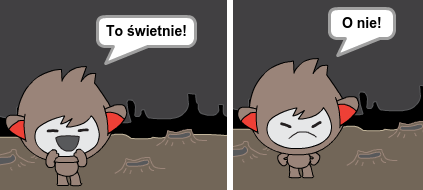
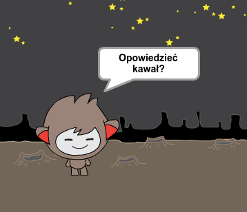

## Krok 3: Podejmowanie decyzji

Możesz zaprogramować robota tak, aby decydował co zrobić na podstawie odpowiedzi użytkownika.

+ Czy potrafisz sprawić, że Twój robot zada pytanie "Czy wszystko w porządku?" i odpowie "To świetnie!", **jeżeli** użytkownik odpowie "tak"?
    
    Aby dokładnie przetestować swój program, musisz sprawdzić go **dwa razy** - raz wpisując odpowiedź "tak "i drugi raz wpisując "nie".
    
    Powinieneś otrzymać odpowiedź "To świetnie!" tylko wtedy, gdy wpisałeś "tak". Jeśli wpisaleś "nie", robot nie powinien niczego wyświetlać.
    
    

\--- hints \--- \--- hint \--- Po wyświetleniu "Cześć", robot powinien **zapytać** "Czy wszystko w porządku?". **Jeżeli** twoja odpowiedź to "tak", robot powinien **powiedzieć** "To świetnie!". \--- /hint \--- \--- hint \--- Oto bloki, których będziesz potrzebować:  \--- /hint \--- \--- hint \--- Tak powinien wyglądać twój kod:  \--- /hint \--- \--- /hints \---

+ Póki co, Twój robot nie wyświetla żadnej wiadomości, jeżeli wpiszesz "nie" . Czy potrafisz sprawić, że robot wyświetli "O nie!", jeżeli na jego pytanie odpowiesz "nie"?
    
    Przetestuj i zapisz. Twój robot powinien teraz wyświetlić "O nie!", gdy odpowiesz "nie". Tak naprawdę to wyświetli "O nie!", jeżeli na jego pytanie odpowiesz cokolwiek oprócz "tak" (dzieje się tak dzięki wyrażeniu **w przeciwnym razie** w bloku `jeżeli ... to<strong>.

</li>
</ul>

--- hints ---
--- hint ---
Twój robot powinien teraz mówić "To świetnie!", <strong>jeżeli</strong> twoja odpowiedź to "tak", lub "O nie!", jeżeli odpowiesz <strong>coś innego</strong>.
--- /hint ---
--- hint ---
Oto bloki, których będziesz potrzebować:

--- /hint ---
--- hint ---
Tak powinien wyglądać twój kod:

--- /hint ---
--- /hints ---

<ul>
<li>
Wewnątrz bloku <code>jeżeli ... to ... w przeciwnym razie` można umieścić dowolny kod, a nie tylko kod, który sprawia, że Twój robot się odzywa. Jeśli klikniesz zakładkę **Kostium**, zobaczysz że ma więcej niż jeden kostium.
    
    

+ Czy dasz radę zmienić kostium robota tak, aby pasował do wprowadzonej przez Ciebie odpowiedzi na pytanie?
    
    Zapisz i przetestuj. Powinieneś zauważyć zmianę na twarzy robota w zależności od Twojej odpowiedzi.
    
    

\--- hints \--- \--- hint \--- Twój robot powinien teraz **zmienić kostium** zależnie od podanej odpowiedzi. \--- /hint \--- \--- hint \--- Oto bloki, których będziesz potrzebować:  \--- /hint \--- \--- hint \--- Tak powinien wyglądać twój kod:  \--- /hint \--- \--- /hints \---

+ Czy zauważyłeś, że kostium Twojego robota nie zmienił się od ostatniej rozmowy? Dasz radę to naprawić?
    
    
    
    Zapisz i przetestuj: Uruchom swój kod i wpisz "nie", aby Twój robot wyglądał na niezadowolonego. Kiedy ponownie uruchomisz swój kod, twój robot powinien powrócić do kostiumu z uśmiechnięta twarzą zanim zapyta Cię o imię.
    
    

\--- hints \--- \--- hint \--- **Kiedy duszek zostanie kliknięty**, Twój robot powinien w pierwszej kolejności **zmienić kostium** na uśmiechniętą twarz. \--- /hint \--- \--- hint \--- Oto bloki, których będziesz potrzebować:  \--- /hint \--- \--- hint \--- Tak powinien wyglądać twój kod:  \--- /hint \--- \--- /hints \---

\--- challenge \---

## Wyzwanie: Więcej decyzji

Zaprogramuj swojego robota gadułę tak, aby zadawał więcej pytań, na które można odpowiedzieć "tak" lub "nie". Czy potrafisz sprawić, że robot odpowie?

 \--- /challenge \---