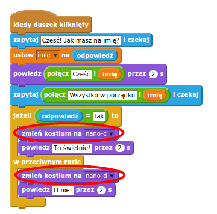

## Krok 3: Podejmowanie decyzji

Możesz zaprogramować robota tak, aby decydował co zrobić na podstawie odpowiedzi użytkownika.

\--- task \---

Can you make the chatbot ask the question "Are you OK?", and code it to reply "That's great to hear!" only **if** the user answers "yes"?

To test your new code properly, you should test it **twice**, once with the answer "yes", and once with the answer "no".

Your chatbot should reply "That's great to hear!" if you answer "yes", but say nothing if you answer "no".

\--- hints \--- \--- hint \--- After your chatbot has said "Hi", it should now also **ask** "Are you OK?". **If** you answer "yes", then the chatbot should **say** "That's great to hear!". \--- /hint \--- \--- hint \--- Here are the extra code blocks you'll need:  \--- /hint \--- \--- hint \--- Here's how your code should look:  \--- /hint \--- \--- /hints \---

\--- /task \---

\--- task \---

At the moment your chatbot doesn't doesn't say anything if you answer "no". Can you change your chatbot so that it also replies "Oh no!" if you answer "no" to its question?

Test and save. Your chatbot should now say "Oh no!" if you answer "no". In fact, it will say "On no!" if you answer with anything other than "yes" (the **else** in an `if/else` block means **otherwise**).

\--- hints \--- \--- hint \--- Your chatbot should now say "That's great to hear!" **if** your answer is "yes", but should say "Oh no!" if you answer something **else**. \--- /hint \--- \--- hint \--- Here are the code blocks you'll need to use:  \--- /hint \--- \--- hint \--- Here's how your code should look:  \--- /hint \--- \--- /hints \---

\--- /task \---

\--- task \---

You can put any code inside an `if/else` block, not just code to make your chatbot speak. If you click your chatbot's **Costume** tab, you'll see that it has more than one costume.

\--- /task \---

\--- task \---

Can you change the chatbot's costume to match your response?

Test and save. You should see your chatbot's face change depending on your answer.

\--- hints \--- \--- hint \--- Your chatbot should now also **switch costume** depending on the answer given. \--- /hint \--- \--- hint \--- Here are the code blocks you'll need to use:  \--- /hint \--- \--- hint \--- Here's how your code should look:  \--- /hint \--- \--- /hints \---

\--- /task \---

\--- task \---

Have you noticed that your chatbot's costume stays the same that it changed to the last time you spoke to it? Can you fix this problem?

Test and save: Run your code and type "no", so that your chatbot looks unhappy. When you run your code again, your chatbot should change back to a smiling face before asking your name.

\--- hints \--- \--- hint \--- When the **sprite is clicked**, your chatbot should first **switch costume** to a smiling face. \--- /hint \--- \--- hint \--- Here's the code block you'll need to add:  \--- /hint \--- \--- hint \--- Here's how your code should look:  \--- /hint \--- \--- /hints \---

\--- /task \---

\--- challenge \---

## Wyzwanie: Więcej decyzji

Program your chatbot to ask another question - something with a "yes" or "no" answer. Can you make your chatbot respond to the answer?

 \--- /challenge \---