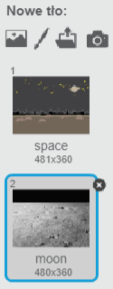
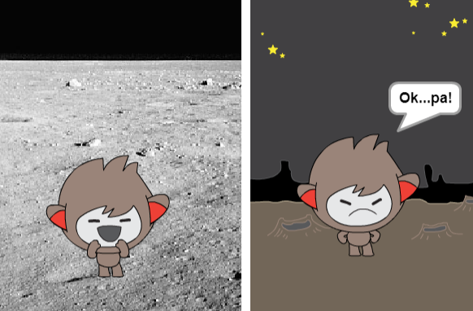
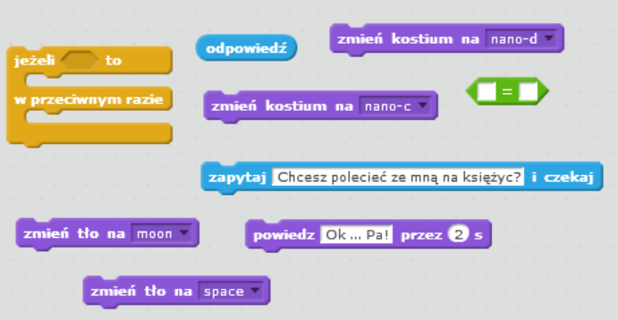
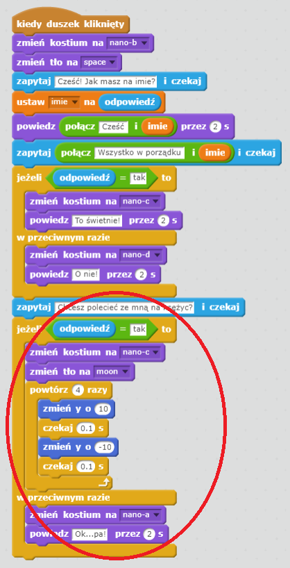
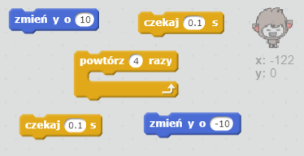
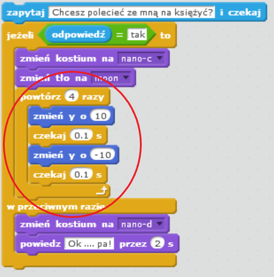

## Zmiana lokalizacji

Możesz również sprawić, że robot zmieni swoją lokalizację.

+ Dodaj inne tło do swojej sceny - na przykład “Księżyc” (ang. “moon”).
    
    

+ Czy potrafisz zakodować swojego robota tak, by zapytał "Chcesz polecieć ze mną na księżyc?" a następnie zmienić lokalizację, jeśli odpowiesz "tak"?
    
    Przetestuj i zapisz. Jeśli odpowiesz "tak", Twój robot powinien zmienić lokalizację. Twój chatbot powinien wyglądać na smutnego i powiedzieć "Ok... Pa!", jeśli podano inną odpowiedź.
    
    

\--- hints \--- \--- hint \--- Twój robot powinien **zapytać** "Chcesz polecieć ze mną na księżyc?". **Jeżeli** twoja **odpowiedź** to "tak", twój robot powinien **zmienić kostium** tak, aby wyglądał na zadowolonego. Powinno też zmienić się **tło** sceny.

Jeśli odpowiesz "nie", robot powinien **zmienić kostium** na smutny i **powiedzieć** "Ok... Pa!"

Musisz też dodać kod, który sprawi, że robot powróci do początkowej lokalizacji **kiedy duszek zostanie kliknięty**. \--- /hint \--- \--- hint \--- Oto bloki, których będziesz potrzebować:  \--- /hint \--- \--- hint \--- Tak powinien wyglądać twój kod:  \--- /hint \--- \--- /hints \---

+ Czy potrafisz zaprogramować swojego robota tak, aby skakał z radości, jeśli powiesz mu, że chcesz polecieć na księżyc?
    
    Przetestuj i zapisz. Jeśli odpowiesz "tak", twój robot powinien zacząć podskakiwać. W przypadku innej odpowiedzi powinien wyglądać na smutnego i powiedzieć "Ok... Pa!".
    
    

\--- hints \--- \--- hint \--- Twój robot powinien podskoczyć, jeśli lekko **zmienisz** jego **pozycję na osi y**, a następnie po ktrótkim **oczekiwaniu** zmienisz jego pozycję do początkowej. Jeżeli chcesz, możesz **powtórzyć ** to kilka razy. \--- /hint \--- \--- hint \--- Oto bloki, których będziesz potrzebować:  \--- /hint \--- \--- hint \--- Tak powinien wyglądać twój kod:  \--- /hint \--- \--- /hints \---