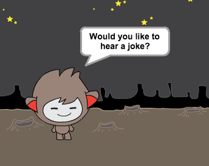

## Wyzwanie: więcej decyzji

Zaprogramuj swojego robota, aby zadał inne pytanie, na które można odpowiedzieć „tak” lub „nie”. Czy możesz sprawić, aby robot reagował inaczej w zależności od tego, jaką odpowiedź otrzyma?

