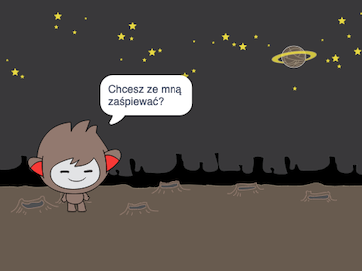
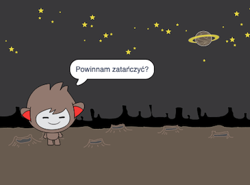
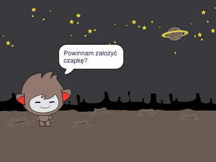

## Wyzwanie: ukończ swojego robota

Wykorzystaj to, czego się nauczyłaś, aby zakończyć tworzenie interaktywnego robota. Oto kilka pomysłów:

Po zakończeniu tworzenia robota zaproś swoich przyjaciół do wspólnej rozmowy z nim! Czy lubią postać Twojego robota gaduły? Czy mogą dostrzec jakieś problemy?