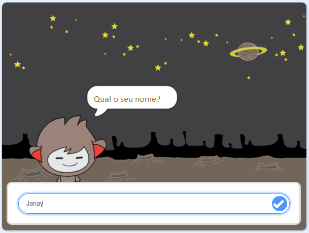

\--- no-print \---

Esta é a versão **Scratch 3** do projeto. Há também uma versão [Scratch 2 do projeto](https://projects.raspberrypi.org/en/projects/chatbot-scratch2).

\--- /no-print \---

## Introdução

Você vai aprender a programar um personagem que pode falar com você! Um personagem como esse é chamado de robô de bate-papo, ou chatbot.

### O que você vai fazer

\--- no-print \---

Clique na bandeira verde e depois clique no personagem do chatbot para iniciar uma conversa. Quando o robô fizer uma pergunta, digite a sua resposta na caixa na parte inferior do Palco e clique na marca azul à direita (ou pressione ` Enter `), para ver a resposta do robô falante.

  <iframe allowtransparency="true" width="485" height="402" src="https://scratch.mit.edu/projects/embed/248864190/?autostart=false" 
  frameborder="0" scrolling="no"></iframe>

\--- /no-print \---

\--- print-only \---

\--- /print-only \---

\--- collapse \---

* * *

## title: O que você vai precisar

### Hardware

- Um computador capaz de executar o Scratch 3

### Software

- Scratch 3 ([ online ](https://rpf.io/scratchon) ou [ off-line ](https://rpf.io/scratchoff))

### Downloads

- [Encontre os arquivos para baixar aqui](http://rpf.io/p/en/chatbot-go).

\--- /collapse \---

\--- collapse \---

* * *

## title: O que você vai aprender

- Usar o código para concatenar strings no Scratch
- Saiba que variáveis podem ser usadas para armazenar a entrada do usuário
- Use a seleção condicional no Scratch para responder à entrada do usuário \--- /collapse \---

\--- collapse \---

* * *

## título: Notas adicionais para educadores

\--- no-print \---

Se você precisar imprimir este projeto, por favor, use a [versão para impressão](https://projects.raspberrypi.org/en/projects/chatbot/print){:target="_blank"}.

\--- /no-print \---

Você pode encontrar o [projeto concluído aqui](http://rpf.io/p/en/chatbot-get).

\--- /collapse \---