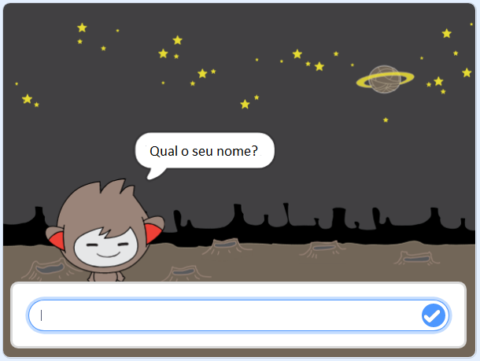
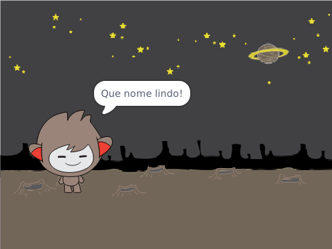

## Um ChatBot falante

Agora que você tem um chatbot com uma personalidade, você vai programá-lo para falar com você.

\--- task \---

Clique no teu ator do robô e adiciona esse código para que ` quando ele for clicado ` {: class = "block3events"}, ` pergunte o seu nome ` {: class = "block3sensing"} e, em seguida, ` diga "Que nome bonito!" ` {: class = "block3looks"}.


```blocks3
quando alguém clicar em você
pergunta [Como você se chama?] e espera pela resposta
diz [Que nome bonito!] durante (2) s
```

\--- /task \---

\--- task \---

Clique no seu chatbot para testar seu código. Quando o chatbot solicitar seu nome, digite-o na caixa que aparece na parte inferior do Palco e clique na marca azul ou pressione <kbd> Enter. </kbd>.





\--- /task \---

\--- task \---

No momento, seu chatbot responde "Que nome bonito!" toda vez que você responde. Você pode tornar a resposta do chatbot mais pessoal, para que a resposta seja diferente sempre que um nome diferente é digitado.

Mude o código do ator do chatbot para `juntar `{:class="block3operators"} "Oi" com a `resposta`{:class="block3sensing"} para "Qual é o seu nome?", para que o código fique assim:


```blocks3
quando alguém clicar em você
pergunta [Como você se chama?] e espera pela resposta
diz (a junção de [Olá] com (a resposta) :: +) durante (2) s
```


\--- /task \---

\--- task \---

Ao armazenar a resposta numa **variável**, você pode usá-la em qualquer lugar do seu projeto.

Cria uma nova variável chamada `nome`{:class="block3variables"}.

[[[generic-scratch3-add-variable]]]

\--- /task \---

\--- task \---

Agora, altere o código dos atores do seu robô para definir a variável ` nome ` {: class = "block3variables"} como ` resposta ` {: class = "block3sensing"}:


```blocks3
quando alguém clicar em você
pergunte [Como você se chama?] e espera pela resposta

+ altera [nome v] para (a resposta)
diz (a junção de [Olá ] com (nome :: + variables)) durante (2) s
```

Seu código deve funcionar como antes: seu chatbot deve dizer oi usando o nome que você digitou.


\--- /task \---

Teste seu programa novamente. Observe que a resposta que você digita é armazenada no `nome`{:class="block3variables"} e também é mostrada no canto superior esquerdo do Palco. Para fazê-la desaparecer do estágio, vá para a seção de blocos `Variáveis`{:class="block3variables"} e clique na caixa ao lado de `nome`{:class="block3variables"} para que não esteja marcado.