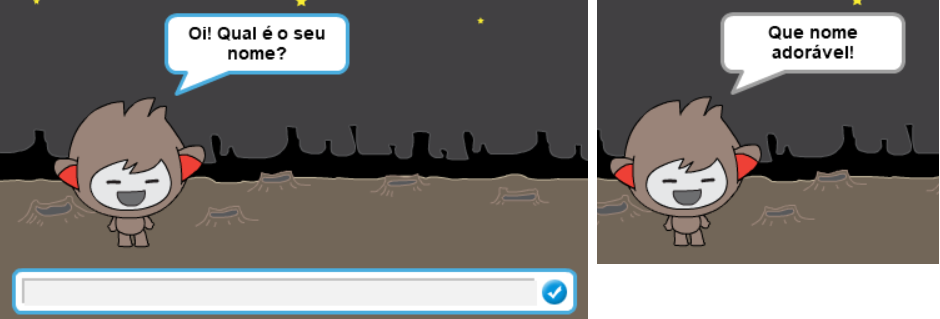
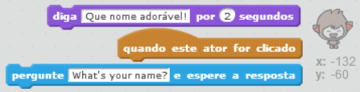
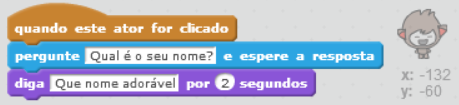
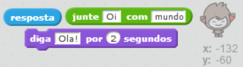
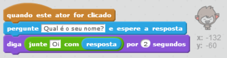
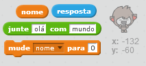
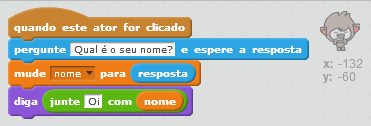
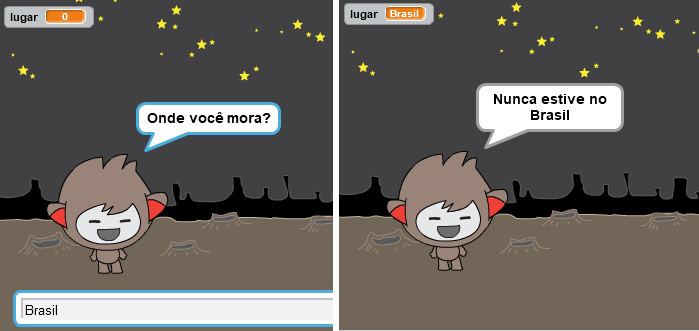

## Um ChatBot falante

Agora que você tem um ChatBot com uma personalidade, vamos programá-lo para conversar com você.

--- task ---

Adicione o código ao seu ChatBot para que, quando clicado, ele pergunte o seu nome e, em seguida, diga "Que nome adorável!"

--- hints --- --- hint --- Quando o **ator do ChatBot** é clicado, ele deve **perguntar** o seu nome. O ChatBot então deve **dizer** "Que nome adorável!" --- /hint --- --- hint --- Aqui estão os blocos de códigos que você precisará:  --- /hint --- --- hint --- Veja como seu código deve ficar:  --- /hint --- --- /hints ---

--- /task ---

--- task ---

Agora o ChatBot simplesmente responde "Que nome adorável!" toda vez. Você pode personalizar a resposta do seu ChatBot, utilizando a sua resposta?

--- hints --- --- hint --- Quando o **ator do ChatBot** é clicado, ele deve **perguntar** o seu nome. O ChatBot deve então **dizer** "Oi", seguido da sua **resposta**. --- /hint --- --- hint --- Aqui estão os blocos de códigos que você precisará:  --- /hint --- --- hint --- Veja como seu código deve ficar:  --- /hint --- --- /hints ---

--- /task ---

--- task ---

Se você armazenar sua resposta em uma **variável**, então pode ser usada mais tarde. Crie uma nova variável chamada `nome` para armazenar o seu nome.

[[[generic-scratch-add-variable]]]

--- /task ---

--- task ---

Você pode armazenar sua resposta na variável `nome` e utilizá-la na resposta do seu ChatBot?

Seu código deve funcionar como antes: seu ChatBot deve dizer olá usando o seu nome.

--- hints --- --- hint --- Quando o **ator do ChatBot** é clicado, ele deve **perguntar** o seu nome. Você deve então **definir** a variável `nome` para a sua **resposta**. O ChatBot deve, então, **dizer** "Oi", seguido do seu **nome**. --- /hint --- --- hint --- Aqui estão os blocos de códigos que você precisará:  --- /hint --- --- hint --- Veja como seu código deve ficar:  --- /hint --- --- /hints ---

--- /task ---

--- challenge ---

## Desafio: Mais perguntas

Programe o seu ChatBot para fazer outra pergunta. Você pode armazenar a resposta em uma nova variável?

 --- /challenge ---