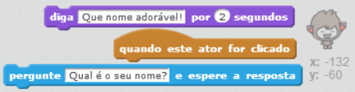
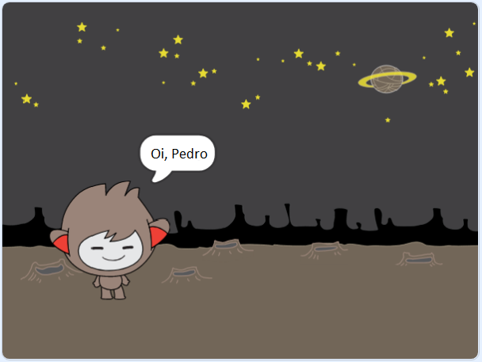
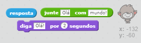

## Um chatbot falante

Agora que você tem um chatbot com uma personalidade, vamos programá-lo para conversar com você.

\--- task \---

Adicione o código ao seu chatbot para que, quando clicado, ele solicite seu nome e, em seguida, diga "Que nome adorável!"

\--- hints \--- \--- hint \--- Quando o sprite do chatbot** é clicado **, ele deve ** perguntar ** pelo seu nome. O chatbot então deve **dizer** "Que nome adorável!" \--- /hint \--- \--- hint \--- Aqui estão alguns blocos de códigos que você vai precisar:  \--- /hint \--- \--- hint \--- Aqui como seu código deve parecer:  \--- /hint \--- \--- /hints \---

\--- /task \---

\--- task \---

Agora o chatbot simplesmente responde "Que nome adorável!" toda vez. Você pode personalizar a resposta do seu chatbot, fazendo uso de sua resposta?

\--- hints \--- \--- hint \--- Quando o sprite do chatbot** é clicado **, ele deve ** perguntar ** pelo seu nome. O chatbot deve então **dizer** "Olá", seguido da sua **resposta**. \--- /hint \--- \--- hint \--- Aqui estão os blocos de código que você precisará:  \--- /hint \--- \--- hint \--- Isto é como seu código deve se parecer:  \--- /hint \--- \--- /hints \---

\--- /task \---

\--- task \---

Se você armazenar sua resposta em uma **variável**, então pode ser usada mais tarde. Crie uma nova variável chamada `nome` para armazenar o seu nome.

[[[generic-scratch-add-variable]]]

\--- /task \---

\--- task \---

Você pode armazenar sua resposta na variável de `nome` e usá-lo na resposta do seu chatbot?

Seu código deve funcionar como antes: seu chatbot deve dizer olá usando seu nome.

\--- hints \--- \--- hint \--- Quando o sprite do chatbot** é clicado **, ele deve ** perguntar ** pelo seu nome. Você deve então **definir** a variável de `nome` para sua **resposta**. O chatbot deve, então, **dizer** "Oi", seguido de seu **nome**. \--- /hint \--- \--- hint \--- Aqui estão os blocos de código que você precisará:  \--- /hint \--- \--- hint \--- Isto é como seu código deve se parecer:  \--- /hint \--- \--- /hints \---

\--- /task \---

\--- challenge \---

## Challenge: more questions

Program your chatbot to ask another question. Can you store the answer in a new variable?

 \--- /challenge \---