## Tomando decisões

Você pode programar o que o ChatBot irá falar ou fazer, baseado nas suas respostas às perguntas dele.

--- task ---

Você pode fazer o ChatBot fazer a pergunta "Você está bem?" e programá-lo para responder "Que bom ouvir isso!" somente **se** o usuário responder "sim"?

Para testar o seu novo código corretamente, você deve testá-lo **duas vezes**, uma vez com a resposta "sim" e uma vez com a resposta "não".

Seu ChatBot deve responder "Que bom ouvir isso!" se você responder "sim", mas não deve dizer nada se você responder "não".

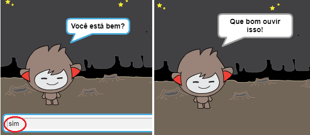

--- hints --- --- hint --- Após o ChatBot ter dito "Oi", agora ele também deve **perguntar** "Você está bem?". **Se** você responder "sim", então o ChatBot deve **dizer** "Que bom ouvir isso!". --- /hint --- --- hint --- Aqui estão os blocos de códigos que você precisará: 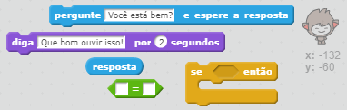 --- /hint --- --- hint --- Veja como seu código deve ficar: 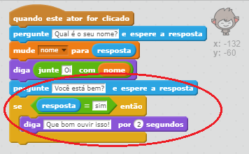 --- /hint --- --- /hints ---

--- /task ---

--- task ---

Até agora o seu ChatBot não diz nada se você responder "não". Você pode mudar o seu ChatBot para que ele também responda "Ah não!" se você responder "não" a pergunta dele?

Teste e salve. Agora o seu ChatBot deverá dizer "Ah não!" se você responder "não". Na verdade, ele dirá "Ah não!" se você responder qualquer coisa diferente de "sim" (O **então** em um bloco `se/então` significa **caso contrário**).

--- hints --- --- hint --- Agora o seu ChatBot deve dizer "Que bom ouvir isso!" **se** a sua resposta for "sim", mas deverá dizer "Ah não!" se você responder **qualquer outra coisa**. --- /hint --- --- hint --- Aqui estão os blocos de códigos que você precisará: 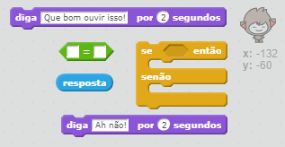 --- /hint --- --- hint --- Veja como seu código deve ficar: 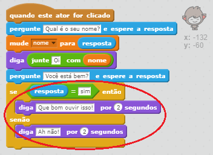 --- /hint --- --- /hints ---

--- /task ---

--- task ---

Você pode colocar qualquer código dentro de um bloco `se/então`, não apenas o código para fazer o seu ChatBot falar. Se você clicar na aba **Fantasias** do seu ChatBot, você verá que ele tem mais de um traje.

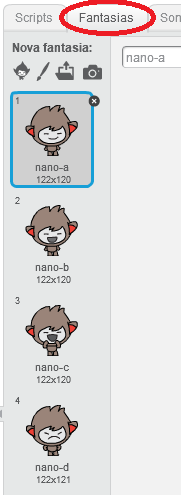

--- /task ---

--- task ---

Você pode mudar a fantasia do ChatBot para coincidir com a sua resposta?

Teste e salve. Você deve ver o rosto do seu ChatBot mudar dependendo da sua resposta.

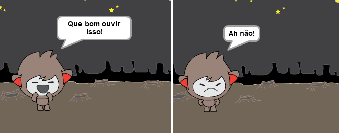

--- hints --- --- hint --- Agora o seu ChatBot deve **mudar de fantasia** dependendo da resposta dada. --- /hint --- --- hint --- Aqui estão os blocos de códigos que você precisará: 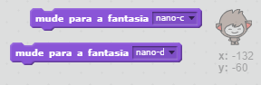 --- /hint --- --- hint --- Veja como seu código deve ficar: 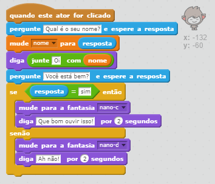 --- /hint --- --- /hints ---

--- /task ---

--- task ---

Você notou que a fantasia do seu ChatBot permanece a mesma desde a última vez que falou com ele? Você pode corrigir esse problema?

Teste e salve: Execute o seu código e digite "não", para que o seu ChatBot se pareça triste. Quando você executar o código novamente, o seu ChatBot deve voltar para um rosto sorridente antes de perguntar o seu nome.

--- hints --- --- hint --- Quando o **ator é clicado**, o seu ChatBot deve primeiro **mudar de fantasia** para um rosto feliz. --- /hint --- --- hint --- Aqui estão os blocos de códigos que você precisará: 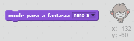 --- /hint --- --- hint --- Veja como seu código deve ficar: 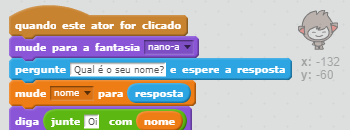 --- /hint --- --- /hints ---

--- /task ---

--- challenge ---

## Desafio: Mais decisões

Programe o seu ChatBot para fazer outra pergunta - algo com "sim" ou "não" como resposta. Você pode fazer seu ChatBot reagir à resposta?

 --- /challenge ---
