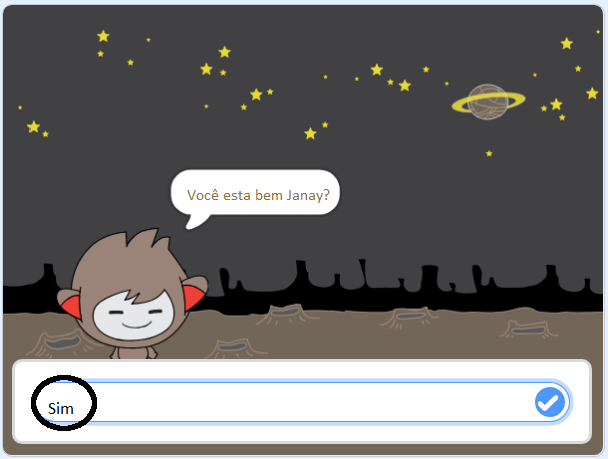
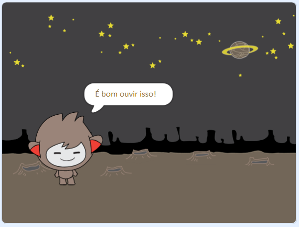
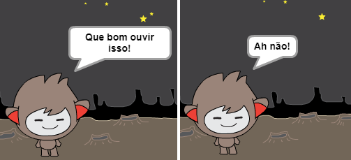
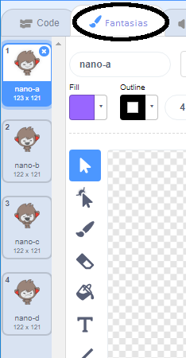
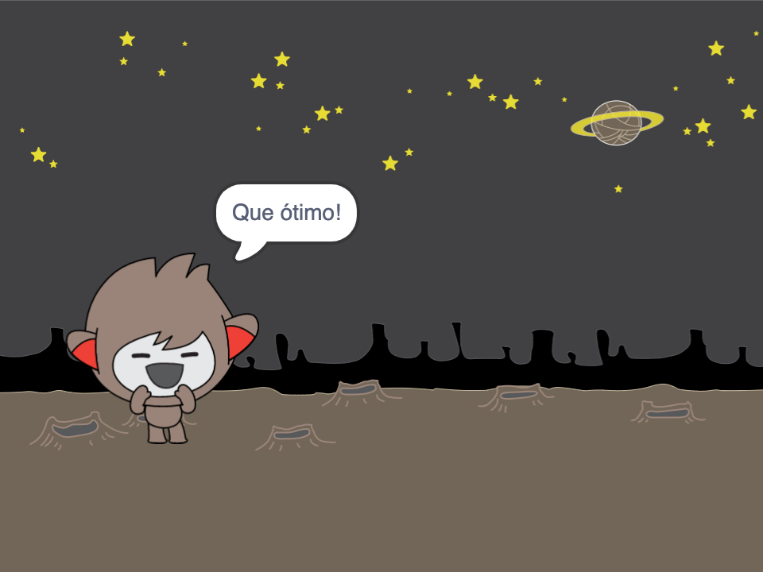
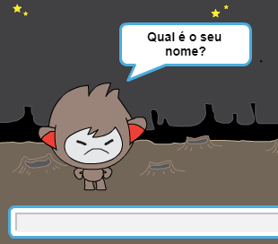
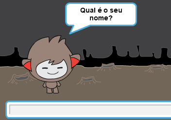

## Tomando decisões

Você pode programar seu chatbot para decidir o que fazer com base nas respostas que recebe.

Primeiro, você fará seu chatbot fazer uma pergunta que possa ser respondida com "sim" ou "não".

\--- task \---

Mude o código do seu chatbot. Seu chatbot deve perguntar "Você está bem, nome?", usando a variável `nome`{:class="block3variables"}. Em seguida, deve responder "É ótimo ouvir isso!" ` se ` {: class = "block3control"} a resposta que recebe é "sim", mas não diga nada se a resposta for "não".






```blocks3
quando alguém clicar em você
pergunta [Como você se chama?] e espera pela resposta
altera [nome v] para (a resposta)
diz (a junção de [Olá ] com (nome)) durante (2) s
+pergunta (a junção de [Você está bem ] com (nome)) e espera pela resposta
+se <(a resposta) = [sim]> , então 
  diz [Que bom ouvir isso!] durante (2) s
end
```

Para testar seu novo código corretamente, você deve testá-lo **duas vezes**: uma vez com a resposta "sim" e uma vez com a resposta "não".

\--- /task \---

No momento, seu chatbot não diz nada para a resposta "não".

\--- task \---

Altere o código do seu chatbot para que ele responda "Ah não!" se ele receber "não" como a resposta para "Você está está bem nome".

Substitua o bloco `se, então`{:class="block3control"} com um `se, então, se não`{:class="block3control"} e inclui o código para que o robô possa `dizer "Oh não!"`{:class="block3look"}.


```blocks3
quando alguém clicar em você
pergunta [Como você se chama?] e espera pela resposta
altera [nome v] para (a resposta)
diz (a junção de [Olá ] com (nome)) durante (2) s
pergunta (a junção de [Você está bem ] com (nome)) e espera pela resposta

+ se <(a resposta) = [sim]> , então 
  diz [Que bom ouvir isso!] durante (2) s
+ se não [Oh não!] durante (2) s 
end
```

\--- /task \---

\--- task \---

Teste seu código. Você deve receber uma resposta diferente ao responder "não" e ao responder "sim": o seu robô deve responder com "Que bom ouvir isso!" quando responde "sim" (que não diferencia maiúsculas de minúsculas) e responder com "Oh não!" quando responde ** outra coisa qualquer **.




\--- /task \---

Você pode colocar qualquer código dentro de um bloco `se, então, se não`{:class="block3control"}, não apenas código para fazer seu chatbot falar!

Se você clicar no menu ** Trajes ** do robô falante, verá que tem mais de um traje.



\--- task \---

Altere o código do seu chatbot para que o chatbot mude os trajes quando você digitar a sua resposta.




Altere o código dentro do bloco `se, então, se não`{:class="block3control"} para `mudar o traje`{:class="block3look"}.


```blocks3
quando alguém clicar em você
pergunta [Como você se chama] e espera pela resposta
altera [nome v] para (a resposta)
diz (a junção de [Olá ] com (nome)) durante (2) s
pergunta (a junção de [Você está bem ] com (nome)) e espera pela resposta
se <(a resposta) = [sim]> , então 
  + muda o seu traje para (nano-c v)
  diz [Que bom ouvir isso!] durante (2) s
se não, 
  + muda o seu traje para (nano-d v)
  diz [Oh nāo!] durante (2) s
end
```

Teste e salve seu código. Você deve ver a mudança de rosto do seu chatbot dependendo da sua resposta.

\--- /task \---

Você notou que, depois de o traje do chatbot ter mudado, ele fica assim e não muda para o que estava no início?

Você pode tentar isso: execute seu código e responda "não" para que o seu chatbot mude de rosto para um visual infeliz. Em seguida, execute seu código novamente e descubra que seu chatbot não muda para ficar feliz antes de pedir o seu nome.



\--- task \---

Para corrigir este problema, adicione ao código do chatbot para `mudar de traje`{:class="block3look"} no início `quando o ator é clicado`{:class="block3events"}.


```blocks3
quando alguém clicar em você

 + muda o seu traje para (nano-a v)
pergunta [Como você se chama?] e espera pela resposta
```



\--- /task \---