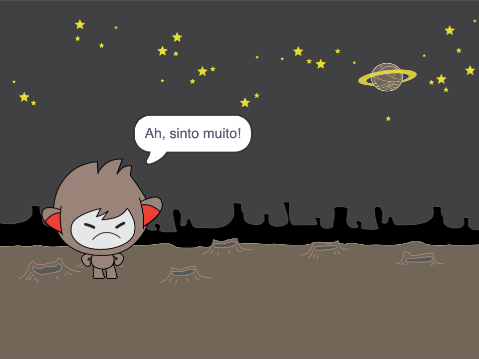

## Tomando decisões

Você pode programar o que o chatbot irá falar ou fazer, baseado nas suas respostas às perguntas dele.

Primeiro, você fará com que seu chatbot faça uma pergunta que possa ser respondida com "sim" ou "não".

\--- task \---

Altere o código do seu chatbot. Seu chatbot deve perguntar "Você está bem, nome?", usando a variável `nome`{:class="block3variables"}. Em seguida, ele deve responder "Isso é ótimo de ouvir!" `se`{:class="block3control"} a resposta recebida for "sim", mas não diga nada se a resposta for "não".


```blocks3
when this sprite clicked
ask [What's your name?] and wait
set [name v] to (answer)
say (join [Hi ] (name)) for (2) seconds
+ask (join [Are you OK ] (name)) and wait
+if <(answer) = [yes]> then 
  say [That's great to hear!] for (2) seconds
end
```

Para testar o seu novo código corretamente, você deve testá-lo **duas vezes**, uma vez com a resposta "sim" e uma vez com a resposta "não".

\--- /task \---

No momento, seu chatbot não diz nada para a resposta "não".

\--- task \---

Altere o código do seu chatbot para que ele responda "Oh não!" se receber "não" como resposta para "Você está bem nome".

Substitua o bloco `se, então`{:class="block3control"} com um `se, então, se não`{:class="block3control"} e inclui o código para que o robô possa `dizer "Oh não!"`{:class="block3look"}.


```blocks3
when this sprite clicked
ask [What's your name?] and wait
set [name v] to (answer)
say (join [Hi ] (name)) for (2) seconds
ask (join [Are you OK ] (name)) and wait

+ if <(answer) = [yes]> then 
  say [That's great to hear!] for (2) seconds
else 
+  say [Oh no!] for (2) seconds
end
```

\--- /task \---

\--- task \---

Teste seu código. Você deve obter uma resposta diferente quando responder "não" e quando responder "sim": seu chatbot deve responder com "Isso é ótimo de ouvir!" quando você responde "sim" (que não diferencia maiúsculas de minúsculas) e responde com "Oh não!" quando você responde **qualquer outra coisa**.


\--- /task \---

Você pode colocar qualquer código dentro de um `if, then, else`{:class="block3control"} bloco, não apenas código para fazer seu chatbot falar!

Se você clicar na aba **Fantasias do seu chatbot** , você verá que há mais de uma fantasia.


\--- task \---

Altere o código do seu chatbot para que o chatbot troque de roupa quando você digitar sua resposta.




Altere o código dentro do bloco `se, então, se não`{:class="block3control"} para `mudar o traje`{:class="block3look"}.


```blocks3
when this sprite clicked
ask [What's your name?] and wait
set [name v] to (answer)
say (join [Hi ] (name)) for (2) seconds
ask (join [Are you OK ] (name)) and wait
if <(answer) = [yes]> then 

+  switch costume to (nano-c v)
  say [That's great to hear!] for (2) seconds
else 
+  switch costume to (nano-d v)
  say [Oh no!] for (2) seconds
end
```

Teste e salve seu código. Você deve ver o rosto do seu chatbot mudar dependendo da sua resposta.

\--- /task \---

Você já reparou que, depois que o traje do seu chatbot mudou, ele continua assim e não volta a ser o que era no início?

Você pode tentar isso: execute seu código e responda "não" para que o rosto do seu chatbot mude para uma aparência infeliz. Em seguida, execute seu código novamente e observe que seu chatbot não volta a parecer feliz antes de perguntar seu nome.


\--- task \---

Para corrigir este problema, adicione ao código do chatbot para `mudar de traje`{:class="block3look"} no início `quando o ator é clicado`{:class="block3events"}.


```blocks3
when this sprite clicked

+ switch costume to (nano-a v)
ask [What's your name?] and wait
```


\--- /task \---