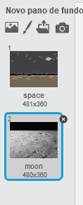
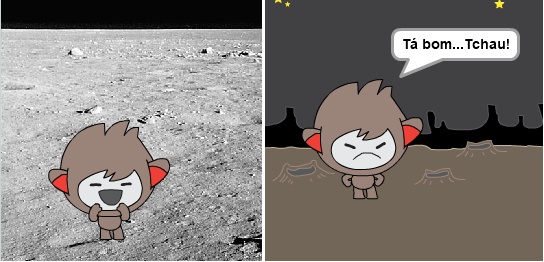
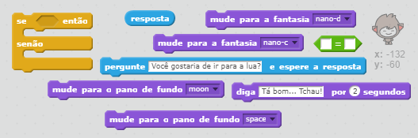
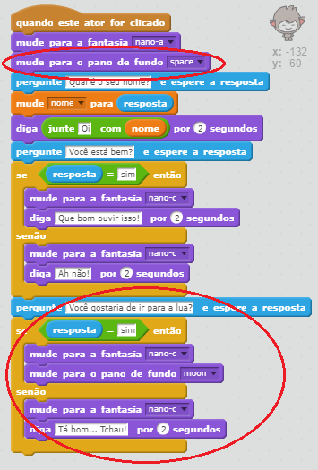
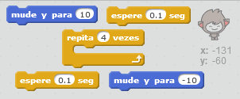
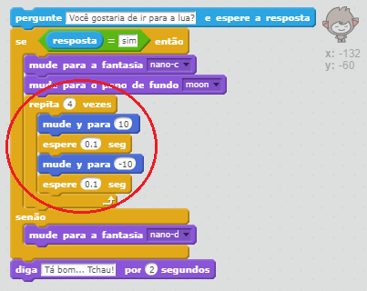

## Mudando de lugar

Você também pode programar o seu ChatBot para mudar de lugar.

--- task ---

Adicione outro pano de fundo ao seu palco, por exemplo, o pano de fundo "moon".

--- /task ---

--- task ---

Você pode programar o seu ChatBot para perguntar "Você gostaria de ir para a lua?" e depois mudar de localização se você responder "sim"?

Teste e salve. Se você responder "sim", o seu ChatBot deve mudar de lugar. O seu ChatBot deve ficar triste e dizer "Tá bom​​... Tchau!" se alguma outra resposta for dada.

--- hints --- --- hint --- O seu ChatBot deve **perguntar** "Você gostaria de ir para a lua?". **Se** a sua **resposta** for "sim", então o seu ChatBot deve **mudar de fantasia** para parecer feliz e o **pano de fundo** do palco deve mudar.

Se você responder "não", o seu ChatBot deve **mudar de fantasia** para parecer triste e **dizer** "Tá bom... Tchau!"

Você também precisará adicionar o código para iniciar o seu ChatBot no lugar certo **quando clicado**. --- /hint --- --- hint --- Aqui estão os blocos de códigos que você precisará:  --- /hint --- --- hint --- Veja como seu código deve ficar:  --- /hint --- --- /hints ---

--- /task ---

--- task ---

Você pode adicionar o código para fazer o seu ChatBot pular de alegria se você disser que irá para a lua?

Teste e salve. Se você responder "sim", o seu ChatBot deve pular de alegria. O seu ChatBot deve ficar triste e dizer "Tá bom​​... Tchau!" se alguma outra resposta for dada.

--- hints --- --- hint --- O seu ChatBot deve pular, **mudando** a sua **posição y** um pouco e, em seguida, voltando a posição inicial após uma breve **espera**. Você pode **repetir** isso algumas vezes. --- /hint --- --- hint --- Aqui estão os blocos de códigos que você precisará:  --- /hint --- --- hint --- Veja como seu código deve ficar:  --- /hint --- --- /hints ---

--- /task ---