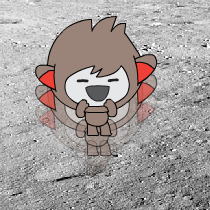

## Alterando localização

Você também pode codificar seu chatbot para mudar sua localização.

\--- task \---

Adicione outro pano de fundo ao seu Palco, por exemplo, o pano de fundo "lua".

\--- /task \---

\--- task \---

Você pode codificar seu chatbot para perguntar "Você gostaria de ir para a lua?" e depois mudar de localização se você responder "sim"?

Teste e salve. Se você responder "sim", seu chatbot deve mudar de local. Seu chatbot deve ficar triste e dizer "Tá bom​​... tchau!" se alguma outra resposta for dada.

\--- hints \--- \--- hint \--- Seu chatbot deve **perguntar** "Você gostaria de ir para a lua?". **se** sua **resposta** é "sim", então o seu chatbot deve **mudar de roupa ** para parecer feliz e o **cenário do palco** deve mudar.

Se você responder "não", o chatbot deve **trocar de roupa** para parecer triste e **dizer** "Tá bom, tchau!"

Você também precisará adicionar código para iniciar seu chatbot no lugar certo **quando clicado**. \--- /hint \--- \--- hint \--- Aqui estão os blocos de código que você precisará:  \--- /hint \--- \--- hint \--- Isto é como seu código deve se parecer:  \--- /hint \--- \--- /hints \---

\--- /task \---

\--- task \---

Você pode adicionar código para fazer o seu chatbot pular de alegria se você disser que quer ir para a lua?

Teste e salve. Se você responder "sim", seu chatbot deve mudar de local. Seu chatbot deve ficar triste e dizer "Tá bom​​... tchau!" se alguma outra resposta for dada.

\--- hints \--- \--- hint \--- Seu chatbot deve pular **mudando** sua **posição y** por uma pequena quantidade e, em seguida, alterando sua posição de volta após uma breve **espera**. Você pode **repetir** isso algumas vezes. \--- /hint \--- \--- hint \--- Aqui estão os blocos de código que você precisará:  \--- /hint \--- \--- hint \--- Isto é como seu código deve se parecer:  \--- /hint \--- \--- /hints \---

\--- /task \---