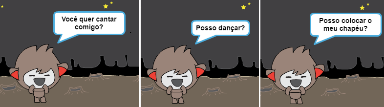

--- challenge ---

## Desafio: Termine o seu ChatBot

Use o que você aprendeu para terminar de criar o seu ChatBot interativo. Aqui estão algumas ideias:

Uma vez você terminou de fazer o seu ChatBot, chame os seus amigos para ter uma conversa com ele! Eles gostaram do seu personagem? Eles identificaram algum problema? ---/challenge ---
***
### Tradução Contribuída pela Comunidade

Este projeto foi traduzido por **Tiago Almeida** e revisado por **Elton Marques**.

Nossos incríveis voluntários de tradução nos ajudam a dar as crianças em todo o mundo a oportunidade de aprender a programar. Você pode nos ajudar a alcançar mais crianças traduzindo nossos projetos - leia mais em [rpf.io/translators](https://rpf.io/translators).
