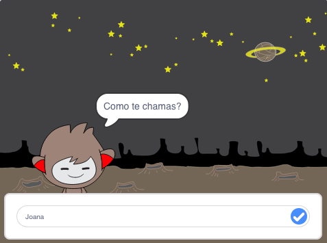

\--- no-print \---

Esta é a versão **Scratch 3** do projeto. Há também uma versão [Scratch 2 do projeto](https://projects.raspberrypi.org/en/projects/chatbot-scratch2).

\--- /no-print \---

## Introdução

Vais aprender a programar um personagem que possa falar contigo! Um personagem como este é chamado de robô falador ou robô falante.

### O que vais fazer

\--- no-print \---

Clica na bandeira verde e, em seguida, clica no robô falante para iniciar uma conversa. Quando o robô fizer uma pergunta, digita a tua resposta na caixa na parte inferior do Palco e clica no "certo" azul à direita (ou pressiona ` Enter `), para veres a resposta do robô falante.

  <iframe allowtransparency="true" width="485" height="402" src="https://scratch.mit.edu/projects/embed/248864190/?autostart=false" 
  frameborder="0" scrolling="no"></iframe>

\--- /no-print \---

\--- print-only \---

\--- /print-only \---

## \--- collapse \---

## title: Do que vais precisar

### Hardware

- Computador capaz de executar o Scratch 3

### Software

- Scratch 3 (ou [ online ](https://rpf.io/scratchon) ou [ off-line ](https://rpf.io/scratchoff))

### Downloads

- [Encontra os ficheiros para download aqui](http://rpf.io/p/en/chatbot-go).

\--- /collapse \---

## \--- collapse \---

## title: O que vais aprender

- Usar o código para concatenar strings no Scratch
- Saber que variáveis podem ser usadas para armazenar as entradas do utilizador
- Usar a seleção condicional no Scratch para responder à entrada do utilizador

\--- /collapse \---

## \--- collapse \---

## title: Notas adicionais para educadores

\--- no-print \---

Se for necessário imprimir este projeto, por favor, use a [versão para impressão](https://projects.raspberrypi.org/en/projects/chatbot/print){: target = "_ blank"}.

\--- /no-print \---

Pode encontrar o [projeto concluído aqui](http://rpf.io/p/en/chatbot-get){: target="_ blank.

\--- /collapse \---