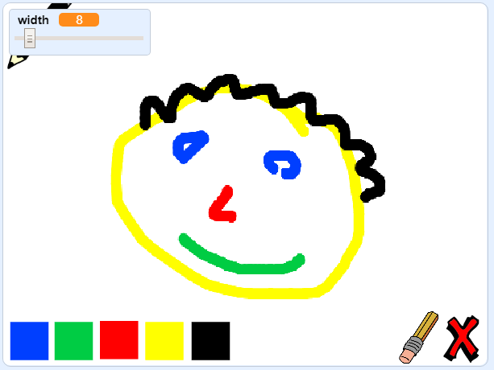

## O que se segue?

Experimenta o projeto [Paint box](https://projects.raspberrypi.org/en/projects/paint-box?utm_source=pathway&utm_medium=whatnext&utm_campaign=projects) onde vais criar o teu próprio programa de pintura!

\--- no-print\--- Clica na bandeira verde para começar. Usa o rato para mover o lápis e mantém pressionado o botão esquerdo do rato para desenhar. Clica numa cor para mudar de lápis. Clica na borracha para mudar para ela e usa-a para apagar o teu trabalho. Para limpar a página, clica na cruz.

  <iframe allowtransparency="true" width="485" height="402" src="//scratch.mit.edu/projects/embed/267243161/?autostart=false" frameborder="0" scrolling="no"></iframe>
  

\--- /no-print \---

\--- print-only \--- Vais clicar na bandeira verde para começar, e vais usar o rato para mover o lápis e manter pressionado o botão esquerdo do mouse para desenhar. Clicar numa cor vai mudar as cores do lápis, e clicar na borracha irá mudar para a borracha!

 \--- /print-only \---