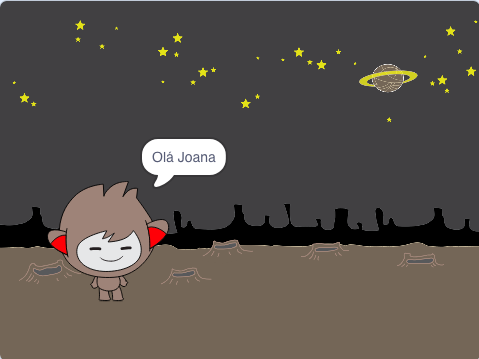

## Um robô falante

Agora que tens um robô falante com personalidade, vamos programá-lo para conversar contigo.

\--- task \---

Clica no teu actor do robô e adiciona-lhe este código para que ` quando ele for clicado ` {: class = "block3events"}, ` pergunte o teu nome ` {: class = "block3sensing"} e, em seguida, ` diga "Que nome tāo bonito!" ` {: class = "block3looks"}.


```blocks3
quando alguém clicar em ti
pergunta [Como te chamas?] e espera pela resposta
diz [Que nome tāo bonito!] durante (2) s
```

\--- /task \---

\--- task \---

Clica no teu robô para testar o teu código. Quando o robô perguntar o teu nome, digita-o na caixa que aparece na parte inferior do Palco e clica na marca azul, ou pressiona <kbd>Enter</kbd>.


\--- /task \---

\--- task \---

De momento, o teu robô responde "Que nome tāo bonito!" todas as vezes que respondes. Podes tornar a resposta do robô mais pessoal, para que a resposta seja diferente sempre que um nome diferente for digitado.

Altera o código do actor robô para ` juntar ` {: class = "block3operators"} "Olá" com a `resposta` {: class = "block3sensing"} para a pergunta "Como te chamas?", de maneira a que fique assim:


```blocks3
quando alguém clicar em ti
pergunta [Como te chamas?] e espera pela resposta
diz (a junção de [Olá] com (a resposta) :: +) durante (2) s
```



\--- /task \---

\--- task \---

By storing the answer in a **variable**, you can use it anywhere your project.

Create a new variable called `name`{:class="block3variables"}.

[[[generic-scratch3-add-variable]]]

\--- /task \---

\--- task \---

Now, change your chatbot sprites’s code to set the `name`{:class="block3variables"} variable to `answer`{:class="block3sensing"}:


```blocks3
when this sprite clicked
ask [What's your name?] and wait

+ set [name v] to (answer)
say (join [Hi ] (name :: variables +)) for (2) seconds
```

Your code should work as before: your chatbot should say hi using the name you type in.


\--- /task \---

Test your program again. Notice that the answer you type in is stored in the `name`{:class="block3variables"} variable, and is also shown in the top left-hand corner of the Stage. To make it disappear from the Stage, go to the `Data`{:class="block3variables"} blocks section and click on the box next to `name`{:class="block3variables"} so that it is not marked.