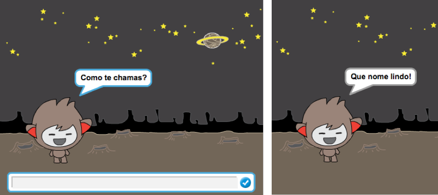
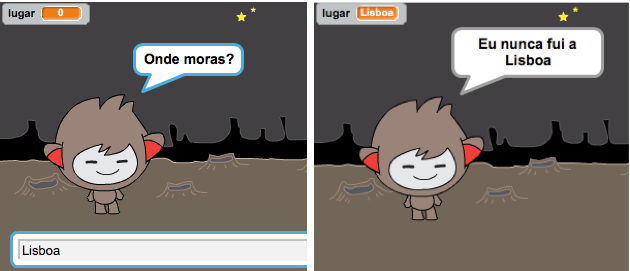

## Um chatbot falante

Agora que tens um robô falante com personalidade, vamos programá-lo para conversar contigo.

\--- task \---

Adiciona código ao teu robô falante para que, quando clicado, ele solicite o teu nome e, em seguida, diga "Que nome lindo!"

\--- hints \--- \--- hint \--- Quando o robô falante** é clicado**, deve **perguntar** o teu nome. O robô falante deve então ** dizer ** "Que nome lindo!!" \--- / hint \--- \--- hint \--- Aqui estão os blocos de código que vais precisar: <1 /> \--- / hint \--- \--- hint \--- Vê como o teu código deve ficar: <2 /> \--- / hint \--- \--- / hints \---

\--- /task \---

\--- task \---

Agora o robô falante todas as vezes simplesmente responde "Que nome lindo!" todas as vezes. Podes personalizar a resposta do teu robô falante, fazendo uso da tua resposta?

\--- hints \--- \--- hint \--- Quando o robô falante** é clicado**, deve **perguntar** o teu nome. O chatbot deve então ** dizer ** "Olá", seguido da tua resposta ** **. \--- / hint \--- \--- hint \--- Aqui estão os blocos de código que vais precisar: <0 /> \--- / hint \--- \--- hint \--- Vê como o teu código deve ficar: <1 /> \--- / hint \--- \--- / hints \---

\--- /task \---

\--- task \---

Se guardares a tua resposta numa **variável**, ela pode ser usada depois. Cria uma nova variável chamada ` nome ` para guardar o teu nome.

[[[generic-scratch-add-variable]]]

\--- /task \---

\--- task \---

Podes guardar a tua resposta na variável `nome` e usá-la na resposta do teu robô falante?

O teu código deve funcionar como antes: o teu robô falante deve dizer olá usando o teu nome.

\--- hints \--- \--- hint \--- Quando o robô** é clicado**, deve **perguntar** o teu nome. Deves então **alterar ** a variável ` nome` para a tua ** resposta**. O robô falante deve então ** dizer ** "Olá", seguido do teu **nome **. \--- / hint \--- \--- hint \--- Aqui estão os blocos de código que vais precisar: <0 /> \--- / hint \--- \--- hint \--- Vê como o teu código deve ficar: <1 /> \--- / hint \--- \--- / hints \---

\--- /task \---

\--- challenge \---

## Desafio: mais perguntas

Programa o teu chatbot para fazer outra pergunta. Podes armazenar a resposta numa nova variável?

 \--- /challenge \---