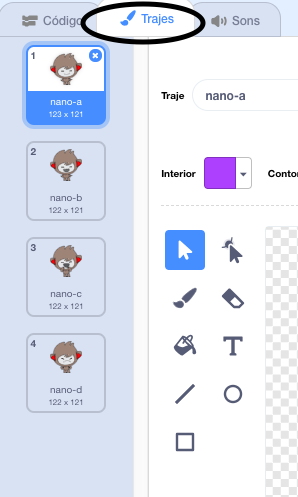
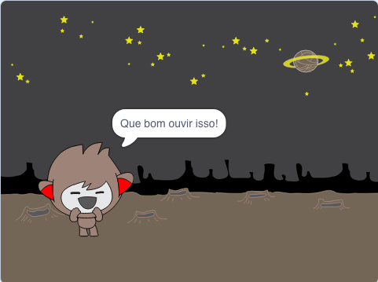
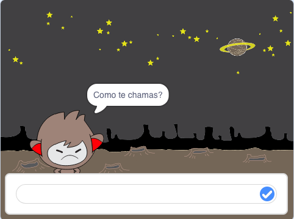

## Tomar decisões

Podes programar o teu robô falante para que ele decida o que dizer ou fazer com base nas respostas que recebe.

Primeiro, vais fazer o teu robô fazer uma pergunta que possa ser respondida com "sim" ou "não".

\--- task \---

Altera o código do teu robô. O teu robô deve fazer a pergunta "Estás OK nome", usando a variável `nome`{:class="block3variáveis"}. Então, deve responder "Que bom ouvir isso!" `se`{:class="block3control"} a resposta que recebe é "sim", mas não dizer nada se a resposta for "não".


```blocks3
quando alguém clicar em ti
pergunta [Como te chamas?] e espera pela resposta
altera [nome v] para (a resposta)
diz (a junção de [Olá ] com (nome)) durante (2) s
pergunta (a junção de [Estás OK ] com (nome)) e espera pela resposta
se <(a resposta) = [Sim]> , então 
  diz [Que bom ouvir isso!] durante (2) s
end
```

Para testares o teu novo código devidamente, deves testá-lo ** duas vezes **, uma vez com a resposta "sim", e uma vez com a resposta "não".

\--- /task \---

De momento, o teu robô não diz nada à resposta "não".

\--- task \---

Altera o código do teu robô para que ele responda "Oh não!" se receber "não" como resposta a "Estás OK nome".

Substitue o bloco `se, então`{:class="block3control"} com um `se, então, senão`{:class="block3control"} e inclui código para que o robô possa `dizer "Oh não!"`{:class="block3look"}.


```blocks3
quando alguém clicar em ti
pergunta [Como te chamas?] e espera pela resposta
altera [nome v] para (a resposta)
diz (a junção de [Olá ] com (nome)) durante (2) s
pergunta (a junção de [Estás OK ] com (nome)) e espera pela resposta
se <(a resposta) = [sim]> , então 
  diz [Que bom ouvir isso!] durante (2) s
end
```

\--- /task \---

\--- task \---

Testa o teu código. Deves receber uma resposta diferente ao responderes "não" e ao responderes "sim": o teu robô deve responder com "Que bom ouvir isso!" quando respondes "sim" (que não diferencia maiúsculas de minúsculas) e responder com "Oh não!" quando respondes ** outra coisa qualquer **.


\--- /task \---

Podes colocar qualquer código dentro de um bloco `se, então, senão`{:class="block3control"}, não apenas código para fazer o teu robô falar!

Se clicares no menu ** Trajes ** do robô falante, verás que tem mais de um traje.



\--- task \---

Altera o código do teu robô para que mude o traje quando digitares a tua resposta.




Altera o código dentro do bloco `se, então, senão`{:class="block3control"} para `mudar o traje`{:class="block3look"}.


```blocks3
quando alguém clicar em ti
pergunta [Como te chamas?] e espera pela resposta
altera [nome v] para (a resposta)
diz (a junção de [Olá ] com (nome)) durante (2) s
pergunta (a junção de [Estás OK ] com (nome)) e espera pela resposta
se <(a resposta) = [sim]> , então 
  + muda o teu traje para (nano-c v)
  diz [Que bom ouvir isso!] durante (2) s
senão, 
  + muda o teu traje para (nano-d v)
  diz [Oh nāo!] durante (2) s
end
```

Testa e guarda o teu código. Deves ver o rosto do teu robô falante mudar de acordo com a tua resposta.

\--- /task \---

Reparaste que depois de o traje do robô ter mudado, ele fica assim e não muda para o que estava no início?

Podes tentar isto: executa o teu código e responde "não" para que o teu robô mude de rosto para um visual triste. Em seguida, executa o teu código novamente e descobre que o teu robô não muda para ficar feliz antes de pedir o teu nome.



\--- task \---

Para resolver este problema, adiciona código para `mudar de traje`{:class="block3look"} no início `quando o actor é clicado`{:class="block3events"}.


```blocks3
when this sprite clicked

+ switch costume to (nano-a v)
ask [What's your name?] and wait
```


\--- /task \---