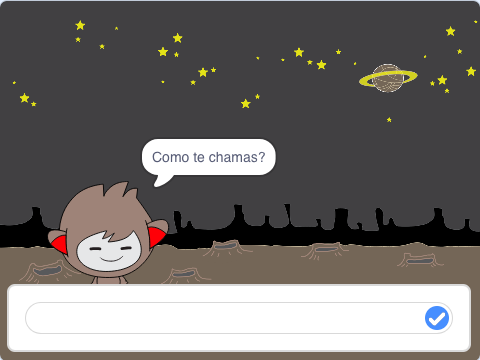

## Tomar decisões

Podes programar o teu robô falante para que ele decida o que dizer ou fazer com base nas respostas que recebe.

Primeiro, vais fazer o teu robô fazer uma pergunta que possa ser respondida com "sim" ou "não".

\--- task \---

Altera o código do teu robô. O teu robô deve fazer a pergunta "Estás OK nome", usando a variável `nome`{:class="block3variáveis"}. Então, deve responder "Que bom ouvir isso!" `se`{:class="block3control"} a resposta que recebe é "sim", mas não dizer nada se a resposta for "não".


```blocks3
quando alguém clicar em ti
pergunta [Como te chamas?] e espera pela resposta
altera [nome v] para (a resposta)
diz (a junção de [Olá ] com (nome)) durante (2) s
pergunta (a junção de [Estás OK ] com (nome)) e espera pela resposta
se <(a resposta) = [Sim]> , então 
  diz [Que bom ouvir isso!] durante (2) s
end
```

To test your new code properly, you should test it **twice**: once with the answer "yes", and once with the answer "no".

\--- /task \---

At the moment, your chatbot doesn't doesn't say anything to the answer "no".

\--- task \---

Change your chatbot's code so that it replies "Oh no!" if it receives "no" as the answer to "Are you OK name".

Replace the `if, then`{:class="block3control"} block with an `if, then, else`{:class="block3control"} block, and include code so the chatbot can `say "Oh no!"`{:class="block3looks"}.


```blocks3
when this sprite clicked
ask [What's your name?] and wait
set [name v] to (answer)
say (join [Hi ] (name)) for (2) seconds
ask (join [Are you OK ] (name)) and wait

+ if <(answer) = [yes]> then 
  say [That's great to hear!] for (2) seconds
else 
+  say [Oh no!] for (2) seconds
end
```

\--- /task \---

\--- task \---

Test your code. You should get a different response when you answer "no" and when you answer "yes": your chatbot should reply with "That’s great to hear!" when you answer "yes" (which is not case-sensitive), and reply with "Oh no!" when you answer **anything else**.


\--- /task \---

You can put any code inside an `if, then, else`{:class="block3control"} block, not just code to make your chatbot speak!

If you click your chatbot's **Costumes** tab, you'll see that there is more than one costume.


\--- task \---

Change your chatbot's code so that the chatbot switches costumes when you type in your answer.


Change the code inside the `if, then, else`{:class="block3control"} block to `switch costume`{:class="block3looks"}.


```blocks3
when this sprite clicked
ask [What's your name?] and wait
set [name v] to (answer)
say (join [Hi ] (name)) for (2) seconds
ask (join [Are you OK ] (name)) and wait
if <(answer) = [yes]> then 

+  switch costume to (nano-c v)
  say [That's great to hear!] for (2) seconds
else 
+  switch costume to (nano-d v)
  say [Oh no!] for (2) seconds
end
```

Test and save your code. You should see your chatbot's face change depending on your answer.

\--- /task \---

Have you noticed that, after your chatbot's costume has changed, it stays like that and doesn't change back to what it was at the beginning?

You can try this out: run your code and answer "no" so that your chatbot's face changes to an unhappy look. Then run your code again and notice that your chatbot does not change back to looking happy before it asks your name.


\--- task \---

To fix this problem, add to the chatbot's code to `switch costume`{:class="block3looks"} at the start `when the sprite is clicked`{:class="block3events"}.


```blocks3
when this sprite clicked

+ switch costume to (nano-a v)
ask [What's your name?] and wait
```



\--- /task \---