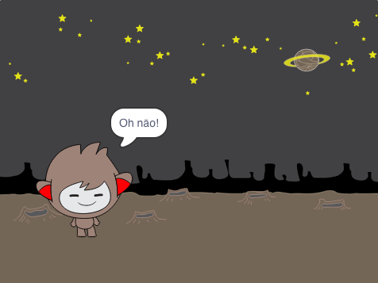
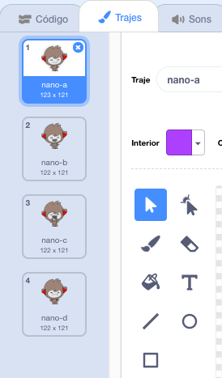

## Etapa 3: Tomar decisões

Podes programar o teu robô falante para que ele decida o que dizer ou fazer com base nas tuas respostas às suas perguntas.

\--- task \---

Podes fazer o robô falante fazer a pergunta "Estás bem?", e codificá-lo para responder "Ainda bem!" somente ** se ** o usuário responde "sim"?

Para testares o teu novo código devidamente, deves testá-lo ** duas vezes **, uma vez com a resposta "sim", e uma vez com a resposta "não".

O teu robô falante deve responder "Ainda bem!!" se você responder "sim", mas não dizer nada se responderes "não".

\--- hints \--- \--- hint \--- Após o seu robô falante ter dito "Ola!", agora também deve ** perguntar ** "Estás bem??". ** Se **responderes "sim", então o robô falante deve ** dizer ** "Ainda bem!". \--- / hint \--- \--- hint \--- Aqui estão os blocos de código que vais precisar: <0 /> \--- / hint \--- \--- hint \--- Vê como o teu código deve ficar: <1 /> \--- / hint \--- \--- / hints \---

\--- /task \---

\--- task \---

De momento, o seu robô falante não diz nada se responderes "não". Podes mudar o teu robô falante para que ele também responda "Oh não!" se responderes "não" à pergunta dele?

Testa e guarda. O teu robô falante agora deve dizer "Oh não!" se você responder "não". Na verdade, ele dirá "Não!" se responderes com alguma resposta diferente de "sim" (o **senão** num bloco ` se / senão ` significa ** caso contrário **).

\--- hints \--- \--- hint \--- O teu robô falante agora diz "Ainda bem!" ** se ** a tua resposta for "sim", e deve dizer "Oh não!" se responderes ** outra coisa **. \--- / hint \--- \--- hint \--- Aqui estão os blocos de código que vais precisar: <0 /> \--- / hint \--- \--- hint \--- Vê como o teu código deve ficar: <1 /> \--- / hint \--- \--- / hints \---

\--- /task \---

\--- task \---

Podes colocar qualquer código dentro de um bloco` se / senão `, não apenas código para fazeres o teu robô falante falar. Se clicares no menu ** Trajes ** do robô falante, verás que tem mais de um traje.

\--- /task \---

\--- task \---

Consegues mudar o traje do robô falante para combinar com a tua resposta?

Testa e guarda. Deves ver o rosto do teu robô falante mudar de acordo com a tua resposta.

\--- hints \--- \--- hint \--- O teu robô falante agora também deve ** trocar de traje ** dependendo da resposta dada. \--- / hint \--- \--- hint \--- Aqui estão os blocos de código que vais precisar: <0 /> \--- / hint \--- \--- hint \--- Vê como o teu código deve ficar: <1 /> \--- / hint \--- \--- / hints \---

\--- /task \---

\--- task \---

Reparaste que o traje do teu robô falante é o mesmo que era a última vez que falaste com ele? Podes corrigir esse problema?

Testa e guarda: Executa o código e digita "não", para que o teu robô falante pareça infeliz. Quando executares o teu código novamente, o teu robô falante deve voltar para um rosto sorridente antes de perguntar o teu nome.

\--- hints \--- \--- hint \--- Quando o **actor é clicado **, o teu robô falante deve primeiro ** trocar de traje ** para um rosto sorridente. \--- / hint \--- \--- hint \--- Aqui está o bloco de código que vais precisar: <0 /> \--- / hint \--- \--- hint \--- Vê como o teu código deve ficar: <1 /> \--- / hint \--- \--- / hints \---

\--- /task \---

\--- challenge \---

## Desafio: mais perguntas

Programa o teu robô falante para fazer outra pergunta - algo com uma resposta "sim" ou "não". Consegues fazer o teu robô falante reagir à resposta?

 \--- /challenge \---