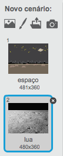
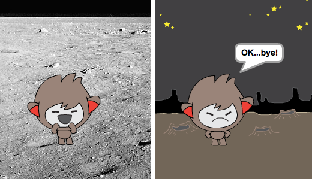
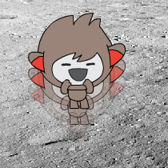

## Mudar de posição

Também podes codificar o teu robô falante para mudar a sua posição.

\--- task \---

Adiciona outro cenário ao teu Palco, por exemplo o cenário "lua".

\--- /task \---

\--- task \---

Podes codificar o teu robô falante para perguntar "Queres ir à lua?" e, depois mudar de cenário se responderes "sim"?

Testa e guarda. Se responderes que "sim", o teu robô falante deve mudar de local. O teu robô falante deve ficar triste e dizer "OK ​​... bye, bye!" se for dada uma resposta diferente.

\--- hints \--- \--- hint \--- O teu robô falante deve **perguntar** "Queres ir à lua?". ** Se ** a tua resposta for** sim** for, então o seu chatbot deve ** mudar de traje** de maneira a parecer feliz e o ** cenário **do palco deve mudar.

Se responderes "não", o robô falante deve ** trocar de traje ** para parecer triste e ** dizer ** "OK, bye, bye!"

Também irás de precisar de adicionar código para iniciar o teu robô falante no lugar certo ** quando clicado **. \--- / hint \--- \--- hint \--- Aqui estão os blocos de código que vais precisar: <0 /> \--- / hint \--- \--- hint \--- Vê como o teu código deve ficar: <1 /> \--- / hint \--- \--- / hints \---

\--- /task \---

\--- task \---

Podes adicionar código para fazer o o teu robô falante pular de alegria se disseres que quer ir para a lua?

Testa e guarda. Se responderes que "sim", o teu robô falante deve saltar para cima e para baixo no mesmo local. Se for dada uma resposta diferente o teu robô falante deve ficar triste e dizer "OK ​​... bye, bye!".

\--- hints \--- \--- hint \--- O teu robô falante deve pular ** mudando ** a sua posição ** y ** por uma pequena quantidade e, em seguida, alterar sua posição de volta após um curto ** esperar **. Pode ** repetir ** isto algumas vezes. \--- / hint \--- \--- hint \--- Aqui estão os blocos de código que vais precisar: <0 /> \--- / hint \--- \--- hint \--- Vê como o teu código deve ficar: <1 /> \--- / hint \--- \--- / hints \---

\--- /task \---