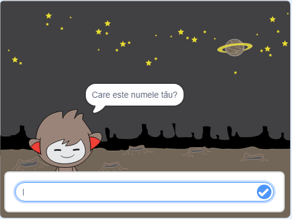

\--- no-print \---

Aceasta este versiunea **Scratch 3** a proiectului. Există, de asemenea, o [versiune Scratch 2 a proiectului](https://projects.raspberrypi.org/en/projects/chatbot-scratch2).

\--- /no-print \---

## Introducere

Vei învăța cum să programezi un personaj care poate vorbi cu tine! Un personaj de genul acesta se numește robot vorbitor, sau chatbot.

### Ce vei face

\--- no-print \---

Dă click pe stegulețul verde, iar apoi dă click pe robotul vorbitor pentru a începe o conversație. Atunci când chatbot-ul pune o întrebare, scrie răspunsul în caseta din partea de jos a Scenei, iar apoi dă click pe bifa albastră din dreapta (sau apasă `Enter`) pentru a vedea răspunsul robotului vorbitor.

  <iframe allowtransparency="true" width="485" height="402" src="https://scratch.mit.edu/projects/embed/248864190/?autostart=false" 
  frameborder="0" scrolling="no"></iframe>

\--- /no-print \---

\--- print-only \---

\--- /print-only \---

## \--- collapse \---

## title: What you will need

### Hardware

- Un computer capabil să ruleze Scratch 3

### Software

- Scratch 3 (fie [online](https://rpf.io/scratchon) sau [offline](https://rpf.io/scratchoff))

### Fișiere descărcabile

- [Găsești fișierele descărcabile aici](http://rpf.io/p/en/chatbot-go).

\--- /collapse \---

## \--- collapse \---

## title: What you will learn

- Use code to concatenate strings in Scratch
- Să afli ce fel de variabile pot fi folosite pentru a stoca răspunsul utilizatorului
- Use conditional selection to respond to user input in Scratch

\--- /collapse \---

## \--- collapse \---

## title: Additional notes for educators

\--- no-print \---

If you need to print this project, please use the [printer-friendly version](https://projects.raspberrypi.org/en/projects/chatbot/print){:target="_blank"}.

\--- /no-print \---

You can find the [completed project here](http://rpf.io/p/en/chatbot-get).

\--- /collapse \---