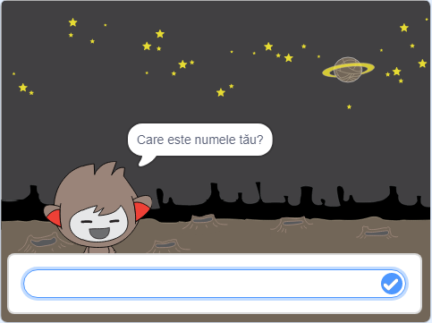
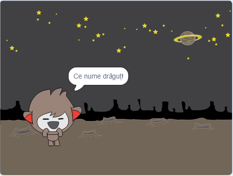
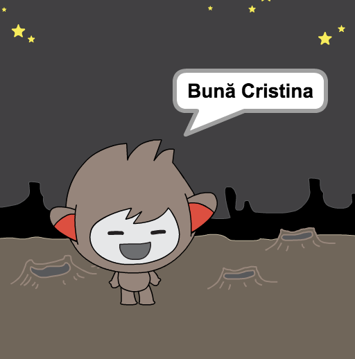

## Un robot vorbitor

Acum, dacă ai un chatbot cu personalitate, îl vei programa să vorbească cu tine.

\--- task \---

Dă click pe costumul robotului tău vorbitor și adaugă acest cod pentru ca atunci `când se dă click pe personaj`{:class="block3events"} să `întrebe care este numele tău`{:class="block3sensing"} iar apoi să `spună „Ce nume drăguț!”`{:class="block3looks"}.


```blocks3
când se dă click pe personaj
întreabă [Care este numele tău?] și așteaptă
spune [Ce nume drăguț!] pentru (2) secunde
```

\--- /task \---

\--- task \---

Dă click pe robotul tău vorbitor pentru a-ți testa codul. Atunci când acesta îți cere numele, scrie-l în caseta care apare în partea de jos Scenei, iar apoi dă click pe bifa albastră sau apasă <kbd>Enter</kbd>.





\--- /task \---

\--- task \---

În acest moment, robotul tău vorbitor îți răspunde cu „Ce nume drăguț!” de fiecare dată când îi răspunzi. Poți să faci răspunsul mai personal, astfel încât răspunsul lui să fie diferit de fiecare dată când i-l spui.

Schimbă codul robotului vorbitor pentru a `alătura`{:class="block3operators"} „Salut” cu `răspunsul`{:class="block3sensing"} la întrebarea „Care este numele tău?”, astfel încât codul să arate astfel:


```blocks3
când se dă click pe personaj
întreabă [Care este numele tău?] și așteaptă
spune (alătură [Salut, ] (răspuns) :: +) pentru (2) secunde
```



\--- /task \---

\--- task \---

Stocând răspunsul într-o **variabilă**, poți să o folosești oriunde în proiectul tău.

Creează o nouă variabilă numită `nume`{:class="block3variables"}.

[[[generic-scratch3-add-variable]]]

\--- /task \---

\--- task \---

Acum, schimbă codul robotului vorbitor pentru a seta variabila `nume`{:class="block3variables"} la `răspuns`{:class="block3sensing"}:


```blocks3
când se dă click pe personaj
întreabă [Care este numele tău?] și așteaptă

+ setează [nume v] la (răspuns)
spune (alătură [Salut, ] (nume :: variables +)) pentru (2) secunde
```

Codul tău ar trebui să funcționeze ca înainte: chatbot-ul tău ar trebui să salute folosind numele tău.


\--- /task \---

Testează-ți din nou programul. Reține că răspunsul pe care îl scrii este stocat în variabila `nume`{:class="block3variables"}, și este de asemenea afișată în colțul din stânga sus al Scenei. To make it disappear from the Stage, go to the `Variables`{:class="block3variables"} blocks section and click on the box next to `name`{:class="block3variables"} so that it is not marked.