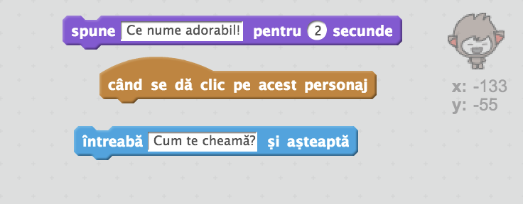
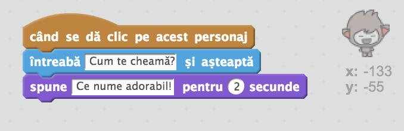
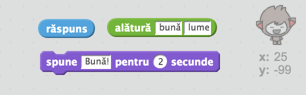
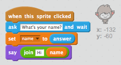

## Un chatbot vorbitor

Acum, dacă aveți un chatbot cu personalitate, haideți să-l programăm să vorbească.

\--- task \---

Adaugă un cod, chatbot-ului tău, ca atunci când e apăsat, să te întrebe numele și să-ți răspundă cu “Ce nume drăguț!”

\--- hints \--- \--- hint \--- Când chatbot-ul **sprite is clicked**, el va **cere**numele tău. Atunci chatbot-ul va răspunde **say** "Ce nume drăguț!" \--- /hint \--- \--- hint \--- Acesta e codul de blocuri, de care ai nevoie:  \--- /hint \--- \--- hint \--- Așa ar trebui să arate:  \--- /hint \--- \--- /hints \---

\--- /task \---

\--- task \---

Acum chatbot-ul răspunde de fiecare dată cu “Ce nume drăguț!” Poți să personalizezi chatbot-ul astfel încât să folosească răspunsul tău?

\--- hints \--- \--- hint \--- Atunci când chatbot **sprite is clicked**, el **cere** numele tău. Chatbot-ul răspunde cu **say** “Bună", utmat de **answer** tău. \--- /hint \--- \--- hint \--- Acestea sunt blocurile de comenzi necesare:  \--- /hint \--- \--- hint \--- Asa ar trebui sa arate:  \--- /hint \--- \--- /hints \---

\--- /task \---

\--- task \---

Dacă stochezi răspunsul tau într-o **variable**, atunci acesta poate fi folosit mai târziu. Creează o nouă variabilă numită `name` pentru a memora numele tău.

[[[generic-scratch-add-variable]]]

\--- /task \---

\--- task \---

Poți salva răspunsul în variabila `name` pentru a-l folosi atunci când chatbot-ul răspunde?

Codul tău ar trebui să funcționeze ca înainte: chatbot-ul tău ar trebui să salute folosind numele tău.

\--- hints \--- \--- hint \--- Atunci când chatbot-ul **sprite is clicked**, el **cere** numele tău. Atunci ar trebui **set** `name` variabilei **answer** tale. Atunci chatbot-ul va raspunde **say** "Bună", urmat de **name**. \--- /hint \--- \--- hint \--- Acestea sunt blocurile de comenzi necesare:  \--- /hint \--- \--- hint \--- Asa ar trebui sa arate:  \--- /hint \--- \--- /hints \---

\--- /task \---

\--- challenge \---

## Provocarea: alte întrebări

Programați-vă chatbot-ul pentru a pune o altă întrebare. Puteți stoca răspunsul într-o nouă variabilă?

 \--- /challenge \---