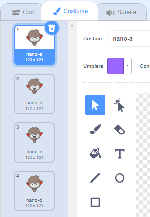
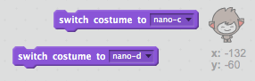
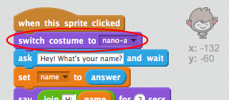

## Pasul 3: Luarea deciziilor

Puteți programa chat-ul să decidă ce să spună sau să facă pe baza răspunsurilor la întrebările sale.

\--- task \---

Îl poți face să te întrebe "Ești bine?", și să-l programezi să raspundă cu "Îmi pare bine!" numai **dacă** i se răspunde cu “da”?

Pentru a testa programul corect, ar trebui să verifici de **twice**ori, odată când răspunsul este “da”, și atunci când este “nu”.

Chatbot-ul tău ar trebui să răspundă "Este minunat!" dacă răspundeți "da", dar să nu spună nimic dacă răspundeți "nu".

\--- hints \--- \--- hint \--- După ce chatbot-ul zice "Bună", ar trebui sa zică **ask** "Ești OK?". **dacă** răspunsul tău e "da", atunci ar trebui să zică**say** "E minunat să aud asta!". \--- /hint \--- \--- hint \--- Acestea sunt blocurile de comenzi necesare:  \--- /hint \--- \--- hint \--- Asa ar trebui sa arate:  \--- /hint \--- \--- /hints \---

\--- /task \---

\--- task \---

În momentul de față, chatbot-ul nu zice nimic dacă răspunsul este “nu”. Poți face ca acesta să raspundă “Vai nu!” dacă răspunsul la întrbare este “nu”?

Testează și salvează. Acum chatbot-ul ar trebui sa zică “Vai nu!” dacă răspunsul este “nu”. De fapt, va zice “Vai nu!” dacă răspunsul este altul decăt “da” (the **else** in an `if/else` block means **otherwise**).

\--- hints \--- \--- hint \--- Chatbot-ul zice "E minunat să aud asta!" **dacă** răspunsul este “da”, și ar trebui să zică “Vai nu!” dacă răspunsul este altceva **else**. \--- /hint \--- \--- hint \--- Acestea sunt blocurile de comenzi necesare:  \--- /hint \--- \--- hint \--- Asa ar trebui sa arate:  \--- /hint \--- \--- /hints \---

\--- /task \---

\--- task \---

Poți pune orice alt cod vrei în interiorul blocului`if/else` nu doar codul care face chatbot-ul să vorbească. Dacă faceți clic pe căsuța chatbot-ului **Costume** Veți vedea că acesta prezintă mai multe deghizări.

\--- /task \---

\--- task \---

Poți schimba deghizarea chatbot-ului astfel încât să fie pe măsura răspunsului tău?

Testează si salvează. Acum ar trebui să vezi cum se schimbă imaginea chatbot-ului în funcție de răspuns.

\--- hints \--- \--- hint \--- Acum chatbot-ul **switch costume** în funcție de răspunsul primit. \--- /hint \--- \--- hint \--- Acestea sunt blocurile de comenzi necesare:  \--- /hint \--- \--- hint \--- Asa ar trebui sa arate:  \--- /hint \--- \--- /hints \---

\--- /task \---

\--- task \---

Ai observat ca imagine chatbot-ului rămâne neschimbată cu imaginea cu care ai vorbit ultima dată? Poți rezolva problema asta?

Testează și salvează: Rulează codul si tastează “nu”, astfel incât chatbot-ul să arate nefericit. Atunci când rulezi codul, din nou, chatbot-ul artrebui să revină la aceeași față zâmbitoare de la început.

\--- hints \--- \--- hint \--- Atunci când **sprite is clicked**, chatbot-ul ar trebui să **switch costume** cu fața zâmbitoarez. \--- /hint \--- \--- hint \--- Acestea sunt blocurile de comenzi necesare:  \--- /hint \--- \--- hint \--- Asa ar trebui sa arate:  \--- /hint \--- \--- /hints \---

\--- /task \---

\--- challenge \---

## Provocare: alte decizii

Programează chatbot-ul să pună o altă întrebare, de genul “da” sau “nu”. Poți face chatbot-ul să răspundă la întrebare?

 \--- /challenge \---