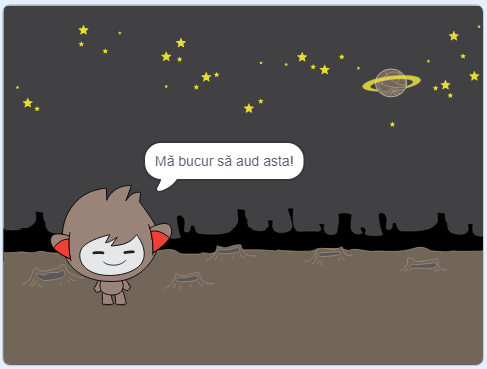

## Luarea deciziilor

Poți programa chatbot-ul să decidă ce să facă pe baza răspunsurilor tale.

În primul rând, vei face ca robotul tău vorbitor să pună o întrebare la care poți răspunde cu „da” sau „nu”.

\--- task \---

Schimbă codul robotului tău vorbitor. Robotul tău vorbitor ar trebui să pună întrebarea „Ești bine, nume”, folosind variabila `nume`{:class="block3variables"}. Apoi ar trebui să răspundă cu „Mă bucur să aud asta!” `dacă`{:class="block3control"} răspunsul primit este un „da”, dar să nu spună nimic atunci când răspunsul este „nu”.





```blocks3
când se dă click pe personaj
întreabă [Care este numele tău?] și așteaptă
setează [nume v] la (răspuns)
spune (alătură [Salut, ] (nume)) pentru (2) secunde
+ întreabă (alătură [Ești bine, ] (nume)) și așteapta
+ dacă <(răspuns) = [da]> atunci 
   spune [Mă bucur să aud asta!] pentru (2) secunde
end
```

Pentru a testa bine noul cod, ar trebui să-l testezi de **două** ori: odată când răspunsul este „da” si odată când este „nu”.

\--- /task \---

În acest moment, robotul tău vorbitor nu spune nimic când răspunzi „nu”.

\--- task \---

Schimbă codul robotului tău vorbitor pentru ca acesta să răspundă cu „Oh nu!” dacă primește un „nu” ca răspuns la întrebarea „Ești bine, nume”.

Înlocuiește blocul `dacă, atunci`{:class="block3control"} cu un bloc `dacă, atunci, altfel`{:class="block3control"} și include cod pentru ca robotul vorbitor să poată să `spună „Oh nu!”`{:class="block3looks"}.


```blocks3
când se dă click pe personaj
întreabă [Care este numele tău?] și așteaptă
setează [nume v] la (răspuns)
spune (alătură [Salut, ] (nume)) pentru (2) secunde
întreabă (alătură [Ești bine, ] (nume)) și așteapta

+ dacă <(răspuns) = [da]> atunci 
   spune [Mă bucur să aud asta!] pentru (2) secunde
altfel 
+  spune [Oh nu!] pentru (2) secunde
end
```

\--- /task \---

\--- task \---

Testează-ți codul. Ar trebui să obții un răspuns diferit atunci când răspunzi cu „nu” și când răspunzi cu „da”: robotul tău vorbitor ar trebui să răspundă cu „Mă bucur să aud asta” atunci când răspunzi cu „da” (care nu e sensibil la majuscule) și să răspundă cu „Oh nu” atunci când răspunzi cu **orice altceva**.


\--- /task \---

Poți pune orice alt cod în interiorul unui bloc de tip `dacă, atunci, altfel`{:class="block3control"}, nu doar codul care face robotul vorbitor să vorbească!

Dacă dai click pe tab-ul **Costume** al robotului vorbitor, vei vedea că acesta are mai multe costume.


\--- task \---

Schimbă codul robotului tău vorbitor pentru ca acesta să își schimbe costumele atunci când trimiți un răspuns.


Schimbă codul din interiorul blocului de tip `dacă, atunci, altfel`{:class="block3control"} pentru a `schimba costumul`{:class="block3looks"}.


```blocks3
când se dă click pe personaj
întreabă [Care este numele tău?] și așteaptă
setează [nume v] la (răspuns)
spune (alătură [Salut, ] (nume)) pentru (2) secunde
întreabă (alătură [Ești bine, ] (nume)) și așteapta
dacă <(răspuns) = [da]> atunci 
+  schimbă costumul la (nano-c v)
  spune [Mă bucur să aud asta!] pentru (2) secunde
altfel 
+  schimbă costumul la (nano-d v)
  spune [Oh nu!] pentru (2) secunde
end
```

Testează și salvează-ți codul. Ar trebui să vezi cum se schimbă fața robotului vorbitor în funcție de răspuns.

\--- /task \---

Ai observat că după ce costumul robotului tău vorbitor s-a schimbat, acesta rămâne neschimbat?

Poți încerca asta: execută codul tău și răspunde cu „nu” pentru a schimba fața robotului tău vorbitor în una tristă. Apoi, execută codul tău din nou și observă cum fața robotului tău vorbitor nu se schimbă înapoi la fața fericită înainte de a-ți cere numele.


\--- task \---

Pentru a remedia această problemă, adaugă la codul robotului tău vorbitor pentru a `schimba costumul`{:class="block3looks"} la început `atunci când se dă click pe personaj`{:class="block3events"}.


```blocks3
când se dă click pe personaj

+ schimbă costumul la (nano-a v)
întreabă [Care este numele tău?] și așteaptă
```


\--- /task \---