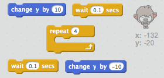

## Schimbarea poziției

Poți programa chatbot-ul să-și schimbe pozitia.

\--- task \---

Adăugați un alt fundal în scenă, de exemplu fundalul "lună".

\--- /task \---

\--- task \---

Poți programa chatbot-ul să intrebe “Vrei să mergi pe lună?” și să își schimbe pozitia dacă răspunsul este”da”?

Testează și salvează. Dacă răspunsul este”da”, chatbot-ul schimbă poziția. Acum chatbot-ul ar trebui să arate supărat și să zică “OK..pa!” dacă e orice alt răspuns.

\--- hints \--- \--- hint \--- Chatbot-ul **cere** "Vrei să mergi pe lună?”. **If** **answer** este "da", atunci chatbot-ul schimbă deghizarea cu**change costume** cea vesela iar fundalul de scenă **backdrop** ar trebui să se schimbe.

Dacă răspunsul e "nu", atunci chatbot-ul **change costume** și va arăta supărat și va **say** "OK...pa!"

Va trebui să adăugați un cod astfel chatbot-ul pornește din locul potrivit **when clicked**. \--- /hint \--- \--- hint \--- Acestea sunt blocurile de comenzi necesare:  \--- /hint \--- \--- hint \--- Asa ar trebui sa arate:  \--- /hint \--- \--- /hints \---

\--- /task \---

\--- task \---

Poți adăuga un cod astfel încât chatbot-ul să sară de bucurie dacă vrei să mergi pe lună?

Testează și salvează. Dacă răspunsul este ”da”, chatbotul sare de bucurie. Dacă alt răspuns este dat chatbot-ul nu ar trebui să sară.

\--- hints \--- \--- hint \--- Chatbot-ul sare **changing** **y position** cu mici incremente, revenind la poziția inițială dupa un timp de **wait**. Va trebui să **repeat** asta de mai multe ori. \--- /hint \--- \--- hint \--- Acestea sunt blocurile de comenzi necesare:  \--- /hint \--- \--- hint \--- Asa ar trebui sa arate:  \--- /hint \--- \--- /hints \---

\--- /task \---