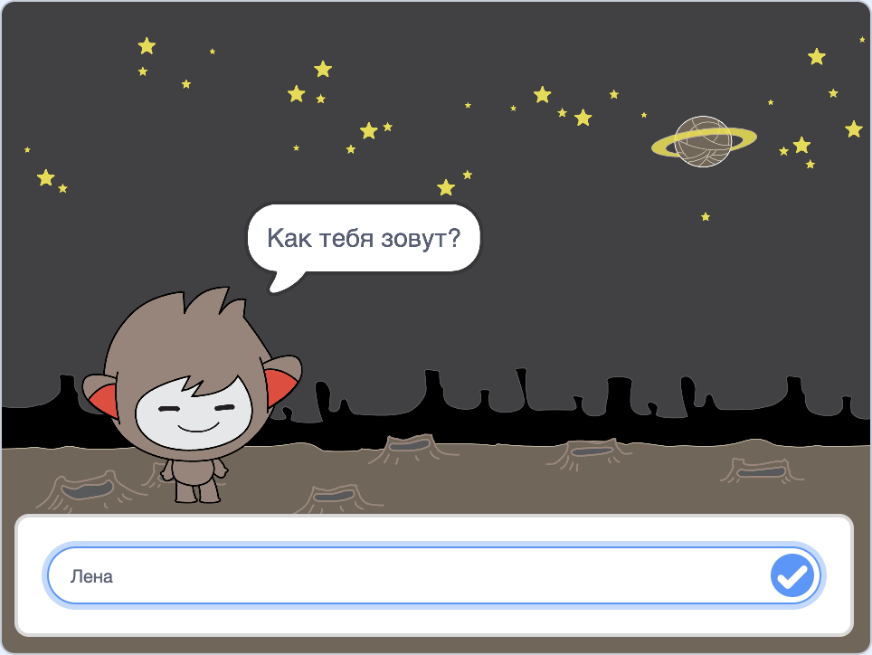

\--- no-print \---

Это **Scratch 3** версия проекта. Существует также [Scratch 2 версия проекта](https://projects.raspberrypi.org/en/projects/chatbot-scratch2).

\--- /no-print \---

## Введение

Ты научишься программировать персонажа, который может говорить с тобой! Такой персонаж называется чат-роботом или чат-ботом.

### Что тебе нужно сделать

\--- no-print \---

Нажми на зеленый флаг, а затем нажми на персонажа чат-бота, чтобы начать разговор. Когда чат-бот задает вопрос, введи свой ответ в поле в нижней части рабочей области, а затем нажми на синюю метку справа (или нажми `Enter`), чтобы увидеть ответ чат-бота.

  <iframe allowtransparency="true" width="485" height="402" src="https://scratch.mit.edu/projects/embed/248864190/?autostart=false" 
  frameborder="0" scrolling="no"></iframe>

\--- /no-print \---

\--- print-only \---

\--- /print-only \---

\--- collapse \---

* * *

## title: Что тебе понадобится

### Оборудование

- Компьютер, способный запускать Scratch 3

### Программное обеспечение

- Scratch 3 ([онлайн](https://rpf.io/scratchon) или [автономный (offline)](https://rpf.io/scratchoff))

### Загрузки

- [Найди файлы для скачивания здесь](http://rpf.io/p/en/chatbot-go).

\--- /collapse \---

\--- collapse \---

* * *

## title: Чему ты научишься

- Use code to concatenate strings in Scratch
- Узнаешь, что переменные могут быть использованы для хранения ввода пользователя
- Использовать операторы условного выбора для ответа на ввод пользователя в Scratch \--- /collapse \---

\--- collapse \---

* * *

## title: Дополнительные примечания для педагогов

\--- no-print \---

Если вы хотите напечатать этот проект, то воспользуйтесь [версией для печати](https://projects.raspberrypi.org/en/projects/chatbot/print){:target="_blank"}.

\--- /no-print \---

Вы можете найти [завершенные проекты здесь](http://rpf.io/p/en/chatbot-get).

\--- /collapse \---