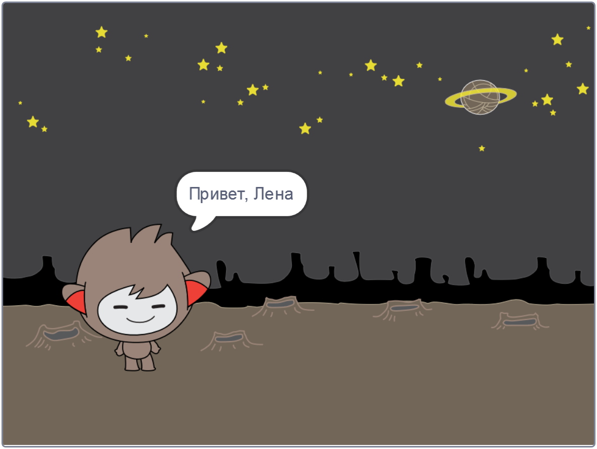

## Говорящий чат-бот

Теперь, когда у твоего чат-бота есть собственный характер, ты запрограммируешь его для общения с тобой.

\--- task \---

Нажмите на спрайт своего чат-бота и добавь для него этот код, чтобы `когда спрайт нажат`{:class="block3events"}, он `спрашивал твое имя`{:class="block3sensing"}, а затем `говорил "Какое прекрасное имя!"`{:class="block3looks"}.


```blocks3
когда спрайт нажат
спросить [Как тебя зовут?] и ждать
говорить [Какое прекрасное имя!] (2) секунд
```

\--- /task \---

\--- task \---

Нажми на чат-бота, чтобы проверить свой код. Когда чат-робот спросит твое имя, введи его в поле, которое появляется в нижней части Сцены, а затем нажми на синюю метку или нажми <kbd>Enter</kbd>.


\--- /task \---

\--- task \---

Прямо сейчас ваш чат-робот отвечает "Какое прекрасное имя!" каждый раз, когда отвечаешь ты. Ты можете сделать ответ чат-бота более личным, так, что ответ будет отличаться при каждом вводе другого имени.

Измени код спрайта чат-бота на `объединить`{:class="block3operators"} "Привет" с `ответом`{:class="block3sensing"} на вопрос "Как тебя зовут?", так, чтобы код выглядел так:


```blocks3
когда спрайт нажат
спросить [Как тебя зовут?] и ждать
говорить (объединить [Привет, ] (ответ) :: +) (2) секунд
```



\--- /task \---

\--- task \---

Сохраняя ответ в **переменной**, вы можете использовать его в любом месте вашего проекта.

Создай новую переменную с именем `имя`{:class="block3variables"}.

[[[generic-scratch3-add-variable]]]

\--- /task \---

\--- task \---

Теперь измени код спрайтов твоего чат-бота, чтобы установить для переменной `имя`{:class="block3variables"} значение `ответ`{:class="block3sensing"}:


```blocks3
когда спрайт нажат
спросить [Как тебя зовут?] и ждать

+ задать [имя v] значение (ответ)
говорить (объединить [Привет, ] (имя :: variables +)) (2) секунд
```

Твой код должен работать как прежде: твой чат-бот должен сказать "привет", используя имя, которое ты вводишь.


\--- /task \---

Проверь свою программу снова. Обрати внимание, что введенный тобой ответ хранится в переменной `имя`{:class="block3variables"}, а также отображается в верхнем левом углу Сцены. Чтобы она исчезла со Сцены, перейди в раздел блоков `Переменные`{:class="block3variables"} и щелкни на чекбоксе рядом с блоком `имя`{:class="block3variables"}, чтобы она не было отмечено галочкой.